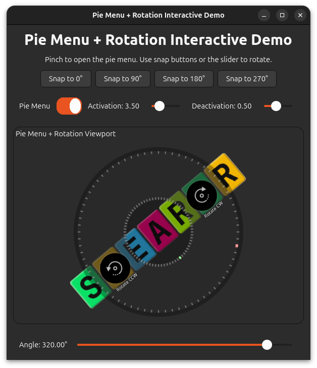

# smearor-wrot-pie-menu

[](https://crates.io/crates/smearor-wrot-pie-menu)
[](https://doc.rust-lang.org/edition-guide/rust-2024/index.html)
[](https://gtk-rs.org/gtk4-rs/stable/latest/docs/gtk4/)
[](LICENSE.md)
[](https://smearor.github.io/smearor-wrot-pie-menu/book/)
[](https://smearor.github.io/smearor-wrot-pie-menu/docs/)

A GTK4 pie menu widget with touch gesture activation for circular menu selection.

## Overview

`smearor-wrot-pie-menu` provides a circular pie menu widget that appears when a
pinch-to-zoom gesture is detected. Menu items are arranged in a ring layout for
easy touch access. The widget is fully configurable — consumers add menu items
via the [`MenuItem`] API and receive events via [`PieMenuMessage`].

## Features

- **Touch gesture activation**: Opens on pinch-to-zoom, closes on pinch-out — both thresholds are configurable
- **Rotation gesture**: Rotate the menu ring with a two-finger rotation gesture
- **Keyboard navigation**: Open with `Ctrl+Space`/`Menu`, navigate with arrows, confirm with `Enter`/`Space` (feature: `keyboard`)
- **Mouse scroll rotation**: Rotate the ring with the mouse wheel, proportional to scroll distance (feature: `mouse-scroll`)
- **Controller support**: Navigate with game controller sticks and buttons (features: `controller-sdl2` or `controller-evdev`)
- **Configurable menu items**: Add/remove items programmatically with custom icons, colors, angles, and events
- **Disabled state**: Disable individual menu items (reduced opacity, no click, no hover, skipped by keyboard navigation)
- **Builder pattern**: Fluent API for ergonomic widget construction (`with_message_sender()`, `with_menu_item()`, etc.)
- **Automatic angle distribution**: Auto-distribute items evenly across the ring with `add_menu_item_auto()`
- **Fixed-position items**: Pin semantically positioned items (e.g. "Rotate CW" at 0°) that resist redistribution
- **Overlap validation**: Prevents visually overlapping items with automatic rollback on failure
- **Hover detection**: Mouse hover highlights the nearest enabled menu item
- **Click-to-select**: Click an enabled menu item to trigger its event
- **Center close button**: Click the center circle to close the menu (or close the current submenu if one is open)
- **Submenus**: Hierarchical nested rings with configurable radii, tiered Escape/center-click navigation, and automatic angle redistribution
- **Registry-based widget system**: All menu items are GTK4 child widgets resolved by type name from a registry
- **Standard widget implementations**: `"circle"`, `"square"`, and `"button"` item types with icon + label rendering
- **Custom widget factories**: Register custom GTK4 widgets as menu item content (gauges, sliders, toggles, charts)
- **Serializable widget configuration**: `widget_type` and `widget_config` fields are serializable for JSON/TOML config files
- **Dynamic widget updates**: `refresh_widgets()` and `set_widget_config()` for live-updating dashboards
- **GTK4 native**: Built as a proper GTK4 widget with `BinLayout` overlay

## Feature Flags

| Feature | Description | Extra Dependencies |
|---------|-------------|--------------------|
| `keyboard` | Keyboard navigation | None |
| `mouse-scroll` | Mouse wheel ring rotation | None |
| `controller-sdl2` | Game controller via SDL2 | `sdl2` |
| `controller-evdev` | Game controller via evdev (Linux-only) | `evdev` |

Keyboard and mouse-scroll are enabled by default. To use controller support:

```toml
[dependencies]
smearor-wrot-pie-menu = { version = "0.1", features = ["controller-sdl2"] }
```

To opt out of default features:

```toml
[dependencies]
smearor-wrot-pie-menu = { version = "0.1", default-features = false }
```

## Quick Start

```rust
use smearor_wrot_pie_menu::CircleConfig;
use smearor_wrot_pie_menu::MenuItem;
use smearor_wrot_pie_menu::PieMenuOverlayWidget;
use smearor_wrot_pie_menu::PieMenuMessage;
use smearor_wrot_pie_menu::overlay_widget::message::handler::PieMenuMessageSender;
use std::sync::mpsc::channel;

let (sender, receiver) = channel::<PieMenuMessage>();

let overlay = PieMenuOverlayWidget::new(Some(&child_widget))
    .with_message_sender(sender)
    .with_activation_threshold(2.5)
    .with_menu_item(
        MenuItem::builder()
            .id("rotate-cw")
            .widget_type("circle")
            .config(CircleConfig::builder()
                .icon_name("object-rotate-right-symbolic")
                .label("Rotate CW")
                .color("#00000077")
                .build())
            .angle(0.0)
            .fixed_position(true)
            .event("rotate-cw")
            .build(),
    )?;

// Handle messages in your event loop
match receiver.try_recv() {
    Ok(PieMenuMessage::Opened) => { /* pie menu opened */ }
    Ok(PieMenuMessage::Closed) => { /* pie menu closed */ }
    Ok(PieMenuMessage::Rotate(degrees)) => { /* handle rotation */ }
    Ok(PieMenuMessage::Event(name)) => { /* handle event by name */ }
    Ok(PieMenuMessage::SubmenuOpened(parent_id)) => { /* submenu opened */ }
    Ok(PieMenuMessage::SubmenuClosed(parent_id)) => { /* submenu closed */ }
    Err(_) => {}
}
```

## Interactive Demo



Run the interactive demo that integrates `smearor-wrot-rotation`:

```sh
cargo run --example interactive_demo
```

## API

### `PieMenuOverlayWidget`

The main widget. Wrap any child widget with this overlay to add pie menu functionality.

### `MenuItem`

A single menu item with an id, angle, radius, event name, enabled state, fixed-position flag, optional submenu items, and widget configuration (`widget_type`, `widget_config`, `content_size`, `content_rotates`). Visual properties (icon, label, colors) are defined in widget-specific config structs (`CircleConfig`, `SquareConfig`, `ButtonConfig`).

### `PieMenuMessage`

Messages sent from the pie menu to the consumer:
- `Opened` — the pie menu was opened
- `Closed` — the pie menu was closed
- `Rotate(f32)` — rotation delta in degrees from the rotation gesture
- `Event(String)` — the event name of the clicked menu item
- `SubmenuOpened(String)` — a submenu was opened (contains parent item id)
- `SubmenuClosed(String)` — a submenu was closed (contains parent item id)

## License

MIT