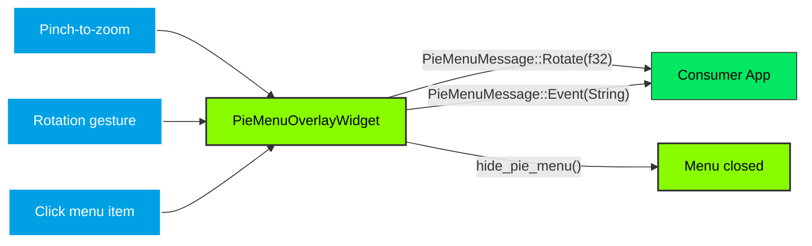
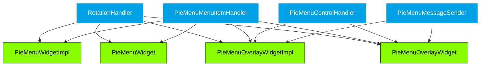

# Architecture

`PieMenuOverlayWidget` achieves its pie menu functionality through three core components working together within the GTK4 layout and rendering pipeline.

## Overview

The pie menu is composed of two widgets:

- **`PieMenuOverlayWidget`** — The outer overlay that wraps a child widget and handles gestures
- **`PieMenuWidget`** — The inner widget that renders the circular menu ring

## Core Components

### 1. Overlay Widget (`PieMenuOverlayWidget`)

The overlay widget is a `gtk4::Widget` subclass that contains:

- A `gtk4::Overlay` as its layout container
- A `PieMenuWidget` added as an overlay on top of the child widget
- Gesture controllers for zoom, rotation, and click detection

**Gesture handling:**

- **`GestureZoom`**: Detects pinch-to-zoom. When scale > 3.5, the pie menu is shown. When scale < 0.5, it is hidden.
- **`GestureRotate`**: Detects two-finger rotation. When the angle delta exceeds 10 degrees, the menu rotation is updated and a `PieMenuMessage::Rotate` message is sent.
- **`GestureClick`**: Detects clicks on the center circle (close menu) and on menu items (send `PieMenuMessage::Event`).

### 2. Pie Menu Widget (`PieMenuWidget`)

The pie menu widget is a `gtk4::Widget` subclass that renders:

- A ring-shaped background (outer circle minus inner circle, using even-odd fill rule)
- 5-degree markings on both inner and outer edges, with highlights at the zero position and current rotation
- Menu items positioned at their configured angles, each consisting of:
  - A colored background circle with shadow
  - A GTK icon from the icon theme
  - A text label below the icon
- Mouse hover highlighting via `EventControllerMotion`

**State:**

- `rotation: AtomicF32` — current rotation in degrees
- `radius: AtomicF32` — outer ring radius (default: 160px)
- `center_radius: AtomicF32` — inner ring radius (default: 64px)
- `menu_items: Arc<Menu>` — thread-safe collection of `MenuItem`
- `hovered_item_index: RefCell<i32>` — currently hovered item (-1 = none)

### 3. Data Model (`MenuItem`, `Menu`)

- **`MenuItem`**: Built with `TypedBuilder`. Fields: `id`, `label`, `label_color`, `icon_name`, `color`, `angle`, `radius`, `event`. `Hash`/`Eq` by `id`.
- **`Menu`**: `DashMap<String, MenuItem>` wrapper with a builder pattern.
- **`RgbaColor`/`RgbColor`**: Self-contained color types with hex parsing and `gdk::RGBA` conversion.

## Message Flow

## Trait Hierarchy

