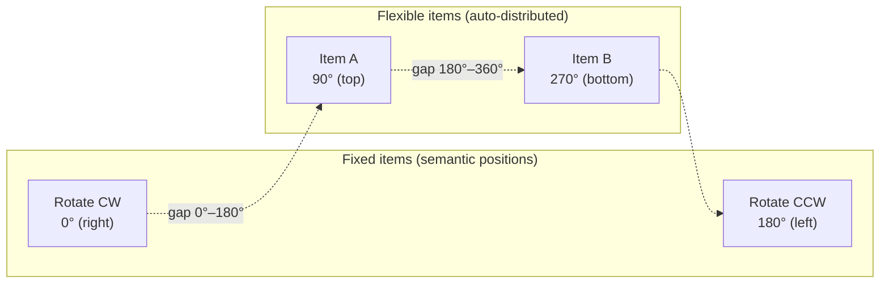

# Auto Distribution

The `add_menu_item_auto()` method automatically calculates item angles, distributing them evenly across the ring.

## Basic Usage

```rust
// Add items without specifying a meaningful angle —
// the angle is computed automatically
overlay.add_menu_item_auto(
    MenuItem::builder()
        .id("item-a")
        .angle(0.0) // ignored for flexible items
        .event("a")
        .config(CircleConfig::builder()
            .icon_name("icon-a")
            .label("A")
            .build())
        .build(),
)?;
```

## Even Distribution

When no items have `fixed_position`, all items are evenly spaced across 360°:

```
1 item  → 0°
2 items → 0°, 180°
3 items → 0°, 120°, 240°
4 items → 0°, 90°, 180°, 270°
```

## Fixed-Position Items

Items with `fixed_position(true)` keep their angle as a semantic anchor. Flexible items are distributed in the gaps between fixed items, with wider gaps receiving proportionally more items.

```rust
// Fixed items define anchor points
let rotate_cw = MenuItem::builder()
    .id("rotate-cw")
    .angle(0.0)
    .fixed_position(true)
    .event("rotate-cw")
    .config(CircleConfig::builder()
        .icon_name("object-rotate-right-symbolic")
        .label("Rotate CW")
        .build())
    .build();

let rotate_ccw = MenuItem::builder()
    .id("rotate-ccw")
    .angle(180.0)
    .fixed_position(true)
    .event("rotate-ccw")
    .config(CircleConfig::builder()
        .icon_name("object-rotate-left-symbolic")
        .label("Rotate CCW")
        .build())
    .build();
```

With two fixed items at 0° and 180°, two flexible items are placed at 90° and 270°.



## Proportional Segment Sizing

The distribution algorithm uses the **largest remainder method** to allocate flexible items to segments proportionally to their angular width. This ensures all items are distributed even when the math doesn't divide evenly.

## Rollback

If overlap validation fails after redistribution, the entire operation is rolled back:

1. The new item is removed (or the previous item is restored on overwrite)
2. All angle changes to existing items are reverted to their pre-redistribution values
3. `AddMenuItemError::ItemOverlap` is returned

## Manual Redistribution

After removing items with `remove_menu_item()`, the remaining flexible items are not automatically re-spaced. Call `redistribute()` to trigger redistribution:

```rust
overlay.remove_menu_item("shuffle")?;
overlay.redistribute();
```

This re-runs the proportional distribution algorithm, keeping fixed-position items in place and re-spacing flexible items in the gaps between them.
