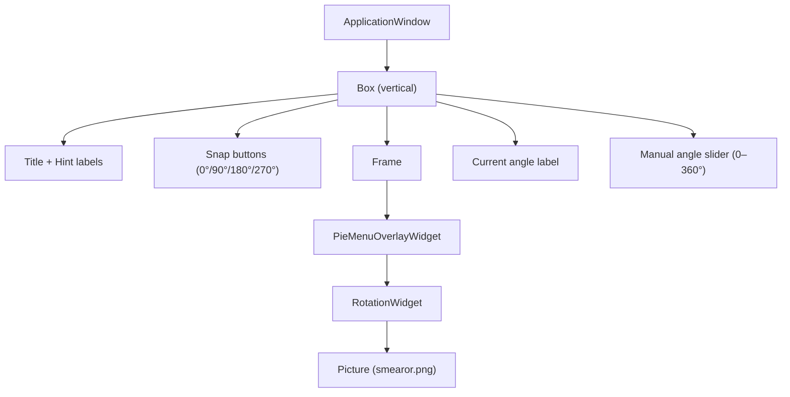
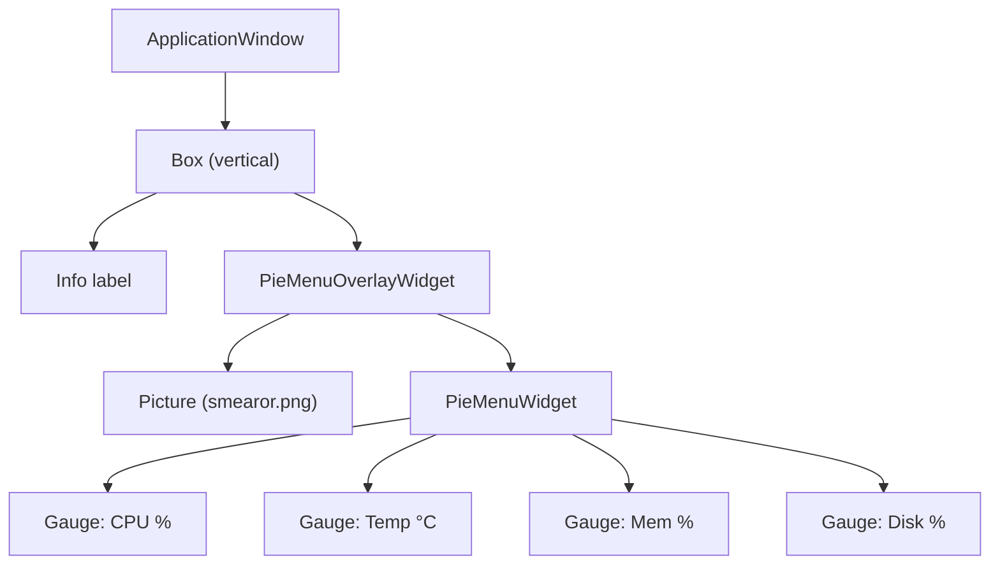

# Examples

The library ships with an interactive demo application that integrates `PieMenuOverlayWidget` with [`smearor-wrot-rotation`](https://github.com/smearor/smearor-wrot-rotation).

## Interactive Demo

A `RotationWidget` rendering the smearor logo (`assets/smearor.png`), wrapped by a `PieMenuOverlayWidget`. Snap buttons and a manual angle slider control the rotation, while pie menu items trigger clockwise / counter-clockwise rotation snaps.

### Screenshot


### Launch

```sh
cargo run --example interactive_demo
```

### Features

The interactive demo provides:

- **Pinch-to-zoom**: Opens the pie menu when scale > 3.5, closes when scale < 0.5
- **Rotation gesture**: Rotates the menu ring and the image with a two-finger twist
- **Menu item clicks**: Sends `PieMenuMessage::Event` with the item's event name
- **Center click**: Closes the pie menu
- **Mouse hover**: Highlights the nearest menu item
- **Snap buttons**: Four buttons (0°, 90°, 180°, 270°) that animate the `RotationWidget` to the target angle via `set_rotation_with_animation`
- **Manual angle slider**: A 0–360° slider that sets the rotation directly via `set_rotation`
- **Pie menu rotation events**: "Rotate CW" and "Rotate CCW" menu items snap the rotation by ±90° with animation
- **Rotation sync**: A 16 ms tick callback synchronizes the `RotationWidget` rotation back to the `PieMenuOverlayWidget`, the slider, and the angle label

### Integration Overview



### How It Works

1. **Widget hierarchy**: A `Picture` widget loads `assets/smearor.png` and is set as the child of a `RotationWidget`. The `RotationWidget` is then passed as the child of a `PieMenuOverlayWidget`.

2. **Message channel**: An `mpsc::channel` connects the `PieMenuOverlayWidget` (sender) to the application event loop (receiver). Menu item selections produce `PieMenuMessage::Event` messages, while rotation gestures produce `PieMenuMessage::Rotate` messages.

3. **Snap buttons**: Each button calls `rotation_widget.set_rotation_with_animation(target_degrees)` and updates the slider, label, and pie menu rotation via `RotationHandler::set_rotation`.

4. **Manual slider**: The slider's `value-changed` signal calls `rotation_widget.set_rotation(SmearorRotation::Deg(angle))` for immediate (non-animated) rotation.

5. **Pie menu events**: The message loop handles `rotate-cw` and `rotate-ccw` events by computing the new rotation (current ± 90°, wrapped to 0–360°) and calling `set_rotation_with_animation`.

6. **Rotation sync**: A `glib::timeout_add_local` callback polls the `RotationWidget`'s rotation every 16 ms. When the rotation changes (e.g. via gesture), it propagates the new angle to the `PieMenuOverlayWidget`, the slider, and the label.

### Dependencies

The demo requires `smearor-wrot-rotation` as a dev-dependency:

```toml
[dev-dependencies]
smearor-wrot-rotation = { path = "../smearor-wrot-rotation" }
```

## Sysinfo Dashboard

A system information dashboard that displays CPU usage, CPU temperature, memory usage, and disk usage as `Gauge` widgets within a pie menu. The gauge values are refreshed every second using the [`sysinfo`](https://crates.io/crates/sysinfo) crate. The smearor logo is rendered as the overlay's background child widget.

### Launch

```sh
cargo run --example sysinfo_dashboard
```

### Features

- **Four gauge widgets**: CPU %, CPU temperature (°C), memory %, disk usage %
- **80% arc tachometer rendering**: Each gauge draws a 288° arc with color-coded zones (green / orange / red)
- **Color-coded thresholds**: Warning and critical thresholds define the zone boundaries
- **1-second refresh**: A `glib::timeout_add_local` callback refreshes `sysinfo::System`, `sysinfo::Components`, and `sysinfo::Disks` every second and updates each gauge via `set_widget_config`
- **Configurable ring size**: Uses `with_pie_menu_radius(250.0)` and `with_pie_menu_center_radius(100.0)` to fit the larger gauge widgets
- **Smearor logo background**: Renders `assets/smearor.png` as the overlay's child widget

### Integration Overview



### How It Works

1. **Widget hierarchy**: A `Picture` widget loads `assets/smearor.png` and is passed as the child of `PieMenuOverlayWidget`. A vertical `Box` places an info label at the top and the overlay below.

2. **Gauge items**: Four `MenuItem`s with `widget_type("gauge")` and `GaugeConfig` are added at 0°, 90°, 180°, and 270°. Each has appropriate `min`, `warning`, `critical`, and `max` values.

3. **Ring sizing**: `with_pie_menu_radius(250.0)` enlarges the ring to fit the 70px-radius gauge widgets. `with_pie_menu_center_radius(100.0)` adjusts the inner radius so items are centered in the ring.

4. **Periodic updates**: A `glib::timeout_add_local` callback fires every second, refreshes `sysinfo` data, and calls `set_widget_config` for each gauge with the updated `GaugeConfig` value.

### Dependencies

The example requires `sysinfo` as a dev-dependency:

```toml
[dev-dependencies]
sysinfo = "0.39"
```
