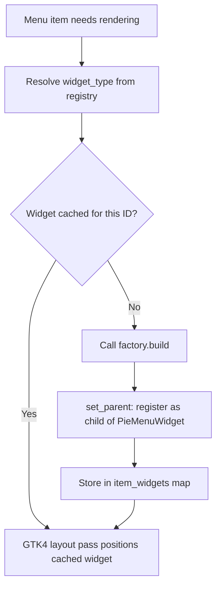

# Custom Widget Content — Registry-Based Widget System

---

## 1. Goal and Motivation

This document describes the concept for a registry-based widget system that allows arbitrary GTK4 widgets as menu item content, replacing the current snapshot-based rendering with a unified widget-child pipeline.

### Goal

Introduce a `MenuItemWidgetFactory` trait and `MenuItemWidgetRegistry` that resolves widget types by name. All menu items — including the existing icon + label rendering — are rendered as GTK4 child widgets registered via `set_parent` and positioned by `WidgetImpl::size_allocate`. The library ships standard implementations (`"circle"`, `"square"`) alongside consumer-registered custom widgets. This unifies the rendering pipeline, eliminates dual rendering paths, and proves the system's flexibility through its own standard implementations.

### Motivation

Currently, each `MenuItem` is drawn directly in the `snapshot` callback — icons, labels, circles, selection rings, hover highlights, shadows. This approach:

- Mixes item-level rendering logic with ring-level rendering in a single method
- Cannot support interactive widgets (sliders, toggles, gauges)
- Prevents GTK4 event picking (hover, click) on individual items

By moving all item rendering to GTK4 child widgets managed by a registry:

- **Unified pipeline**: All items are widget children — no dual rendering paths
- **Encapsulation**: Each widget type encapsulates its own rendering complexity
- **Extensibility**: Consumers register custom widgets by name
- **Proof by existence**: Standard implementations (`"circle"`, `"square"`) prove the system works
- **Interactive content**: Gauges, sliders, toggles, mini-charts, status indicators

---

## 2. Current State

The `smearor-wrot-pie-menu` library currently provides:

- **Touch gesture activation**: Pinch-to-zoom opens/closes the menu (configurable thresholds)
- **Rotation gesture**: Two-finger rotation adjusts the ring angle
- **Menu items**: `MenuItem` with `id`, `label`, `label_color`, `icon_name`, `color`, `angle`, `radius`, `event`, `enabled`, `fixed_position`, `close_on_click`, `submenu` fields
- **Message passing**: `PieMenuMessage` with `Opened`, `Closed`, `Rotate(f32)`, `Event(String)`, `SubmenuOpened(String)`, `SubmenuClosed(String)` variants
- **Hover detection**: Mouse hover highlights the nearest item
- **Click-to-select**: Clicking an item sends `PieMenuMessage::Event`
- **Keyboard navigation**: `Ctrl+Space`/`Menu` to open, arrows/`Tab` to cycle, `Enter`/`Space` to confirm (feature: `keyboard`)
- **Mouse scroll rotation**: Proportional `dy` scaling for smooth ring rotation (feature: `mouse-scroll`)
- **Controller support**: SDL2/evdev analog stick rotation and selection (features: `controller-sdl2` / `controller-evdev`)
- **Auto distribution**: `add_menu_item_auto()` with `fixed_position` and proportional segment sizing
- **Overlap validation**: Prevents visually overlapping items with rollback
- **Submenus**: Nested pie menu rings with hierarchical navigation
- **Rendering**: Snapshot-based drawing via `gtk4::Snapshot` — icons from `IconTheme`, labels via `pango::Layout`, item circles via `RoundedRect`

### What is Missing

| Feature | Status |
|---------|--------|
| `MenuItemWidgetFactory` trait | Not implemented |
| `MenuItemWidgetRegistry` for type resolution | Not implemented |
| `MenuItemContext` for widget event triggering | Not implemented |
| `ItemSize` for non-square widget allocation | Not implemented |
| Typed widget config (associated type on factory) | Not implemented |
| `widget_type` field on `MenuItem` | Not implemented |
| `widget_config` field on `MenuItem` | Not implemented |
| Standard implementations (`"circle"`, `"square"`) | Not implemented |
| Unified widget-child rendering pipeline | Not implemented |
| `refresh_widgets` / `set_widget_config` API | Not implemented |
| `MenuItemWidgetFactoryErased` trait for registry storage | Not implemented |
| `SetWidgetConfigError` error type | Not implemented |
| Widget caching to avoid rebuilding on every draw cycle | Not implemented |
| Rotation behavior for widgets (upright vs. rotating) | Not implemented |

---

## 3. Data Model

### MenuItemWidgetFactory Trait

`MenuItemWidgetFactory` lives in its own file (`src/menu/widget_factory.rs`) following the one-trait-per-file convention:

```rust
use crate::menu::MenuItem;
use crate::menu::context::MenuItemContext;
use gtk4::Widget;
use serde::de::DeserializeOwned;
use serde::Serialize;

/// Typed factory trait for creating menu item widgets.
///
/// Each factory is registered in the [`MenuItemWidgetRegistry`] under
/// a unique type name. When a menu item is rendered, the registry
/// resolves the factory by the item's `widget_type` field and calls
/// `build` to create the GTK4 widget.
///
/// The associated `Config` type provides type-safe, serializable
/// configuration for the widget. The registry automatically
/// deserializes `MenuItem::widget_config` (`serde_json::Value`) into
/// `Config` before calling `build`. This gives consumers full type
/// safety without manual JSON extraction.
///
/// Implementations are `!Send` and `!Sync` because `gtk4::Widget` is
/// bound to the GLib main thread. All registration and rendering occurs
/// on the GTK main thread.
pub trait MenuItemWidgetFactory {
    /// Type-safe configuration for this widget type.
    ///
    /// Must implement `Serialize`, `DeserializeOwned`, and `Default`.
    /// The `Default` value is used when `widget_config` is `None`.
    type Config: Serialize + DeserializeOwned + Default;

    /// Returns the unique type name for this factory.
    ///
    /// This name is used by `MenuItem::widget_type` to resolve the
    /// factory from the registry. Examples: `"circle"`, `"square"`.
    fn type_name(&self) -> &str;

    /// Builds and returns a GTK4 widget for the given menu item.
    ///
    /// The widget is registered as a child of `PieMenuWidget` via
    /// `set_parent` by the rendering pipeline after construction.
    /// The `config` parameter is the typed configuration,
    /// automatically deserialized from `item.widget_config`.
    fn build(&self, item: &MenuItem, config: &Self::Config, context: &MenuItemContext) -> Widget;
}
```

### MenuItemWidgetFactoryErased Trait

`MenuItemWidgetFactoryErased` lives in its own file (`src/menu/widget_factory_erased.rs`). It is the type-erased counterpart to `MenuItemWidgetFactory`, enabling heterogeneous storage in the registry. A blanket implementation bridges the two traits:

```rust
use crate::menu::MenuItem;
use crate::menu::context::MenuItemContext;
use crate::menu::widget_factory::MenuItemWidgetFactory;
use gtk4::Widget;
use serde::de::DeserializeOwned;
use serde::Serialize;

/// Type-erased factory trait for registry storage.
///
/// This trait allows the registry to store factories with different
/// `Config` types in a single `HashMap<String, Box<dyn MenuItemWidgetFactoryErased>>`.
///
/// A blanket implementation automatically converts any
/// `MenuItemWidgetFactory` into a `MenuItemWidgetFactoryErased` by
/// deserializing `item.widget_config` into the factory's `Config` type.
pub trait MenuItemWidgetFactoryErased {
    /// Returns the unique type name for this factory.
    fn type_name(&self) -> &str;

    /// Builds and returns a GTK4 widget, deserializing the config automatically.
    fn build(&self, item: &MenuItem, context: &MenuItemContext) -> Widget;
}

impl<F> MenuItemWidgetFactoryErased for F
where
    F: MenuItemWidgetFactory,
    F::Config: Serialize + DeserializeOwned + Default,
{
    fn type_name(&self) -> &str {
        <Self as MenuItemWidgetFactory>::type_name(self)
    }

    fn build(&self, item: &MenuItem, context: &MenuItemContext) -> Widget {
        let config: F::Config = item
            .widget_config
            .as_ref()
            .and_then(|value| serde_json::from_value(value.clone()).ok())
            .unwrap_or_default();
        <Self as MenuItemWidgetFactory>::build(self, item, &config, context)
    }
}
```

### MenuItemWidgetRegistry Struct

`MenuItemWidgetRegistry` lives in its own file (`src/menu/widget_registry.rs`):

```rust
use std::collections::HashMap;

use crate::menu::widget_factory_erased::MenuItemWidgetFactoryErased;

/// Registry mapping widget type names to their factory implementations.
///
/// The registry is populated with standard implementations (`"circle"`,
/// `"square"`) by the library. Consumers register custom widget
/// factories via [`MenuItemWidgetRegistry::register`].
///
/// The registry is `!Send` and `!Sync` because factories produce
/// `gtk4::Widget` instances bound to the GLib main thread.
pub struct MenuItemWidgetRegistry {
    factories: HashMap<String, Box<dyn MenuItemWidgetFactoryErased>>,
}

impl MenuItemWidgetRegistry {
    /// Creates a new registry pre-populated with standard implementations.
    ///
    /// Standard implementations:
    /// - `"circle"` — circular item with icon + label (existing behavior)
    /// - `"square"` — square item with icon + label
    pub fn new() -> Self {
        let mut registry = Self { factories: HashMap::new() };
        registry.register(Box::new(crate::menu::circle_widget::CircleWidgetFactory));
        registry.register(Box::new(crate::menu::square_widget::SquareWidgetFactory));
        registry
    }

    /// Registers a custom widget factory under its type name.
    ///
    /// If a factory with the same type name already exists, it is
    /// replaced. This allows consumers to override standard
    /// implementations if desired.
    pub fn register(&mut self, factory: Box<dyn MenuItemWidgetFactoryErased>) {
        self.factories.insert(factory.type_name().to_string(), factory);
    }

    /// Resolves a factory by type name.
    ///
    /// Returns `None` if no factory is registered under the given name.
    pub fn get(&self, type_name: &str) -> Option<&dyn MenuItemWidgetFactoryErased> {
        self.factories.get(type_name).map(|boxed| boxed.as_ref())
    }
}

impl Default for MenuItemWidgetRegistry {
    fn default() -> Self {
        Self::new()
    }
}
```

### MenuItemContext Struct

`MenuItemContext` lives in its own file (`src/menu/context.rs`):

```rust
/// Context provided to widget factories, allowing them to trigger
/// pie menu events and access item metadata.
///
/// This struct is passed to the `MenuItemWidgetFactory::build` method
/// alongside the [`MenuItem`](crate::menu::MenuItem) reference. It
/// provides a callback channel for custom widgets to interact with
/// the pie menu's event system without needing direct access to the
/// widget implementation.
///
/// `MenuItemContext` is `!Clone`, `!Send`, and `!Sync` because
/// `trigger_event` contains a `Box<dyn Fn()>`. This is unproblematic
/// since `MenuItemContext` is not stored in `MenuItem` — it is
/// constructed fresh at build time and passed by reference to the
/// factory's `build` method.
pub struct MenuItemContext {
    /// The unique identifier of the menu item.
    pub id: String,
    /// The event name associated with the menu item.
    pub event: String,
    /// Callback to trigger the item's event via the pie menu message system.
    pub trigger_event: Box<dyn Fn()>,
}
```

### Standard Config Types

Each standard implementation defines its own typed config struct. These live alongside their respective factory implementations. For example, `CircleConfig` lives in `src/menu/circle_widget.rs`:

```rust
use serde::Deserialize;
use serde::Serialize;

/// Typed configuration for the `"circle"` widget type.
#[derive(Debug, Clone, Serialize, Deserialize, Default)]
pub struct CircleConfig {
    /// Icon name for GTK4 icon theme lookup.
    pub icon_name: Option<String>,
    /// Text label displayed alongside the icon.
    pub label: Option<String>,
    /// Background color.
    pub color: Option<String>,
    /// Label text color.
    pub label_color: Option<String>,
    /// Icon size in pixels. When `None`, uses the default icon size.
    pub icon_size: Option<u32>,
    /// Whether to show the label. Defaults to `true`.
    pub show_label: Option<bool>,
}
```

When `widget_config` is `None`, `CircleConfig::default()` is used. The `CircleWidgetFactory::build` method falls back to `MenuItem`-level fields (`icon_name`, `label`, `color`, `label_color`) when the corresponding `CircleConfig` fields are `None`.

### ItemSize Struct

`ItemSize` lives in its own file (`src/menu/size.rs`):

```rust
use typed_builder::TypedBuilder;

/// The dimensions of a widget slot on the ring.
///
/// Used when a widget requires a non-square allocation
/// (e.g., a wide slider or a tall gauge). When `None`,
/// the item's `radius` is used for a square allocation
/// of `2 * radius` pixels.
#[derive(Debug, Clone, Copy, TypedBuilder)]
pub struct ItemSize {
    /// The width of the slot in pixels.
    pub width: f32,
    /// The height of the slot in pixels.
    pub height: f32,
}
```

### MenuItem Extension

The `widget_type`, `widget_config`, `content_size`, and `content_rotates` fields are added to `MenuItem`. The existing `icon_name`, `label`, `color`, and `label_color` fields remain as defaults — when `widget_config` does not specify them, the factory falls back to the `MenuItem`-level fields.

```rust
/// A single item in a pie menu
#[derive(Debug, Clone, Serialize, Deserialize, TypedBuilder)]
pub struct MenuItem {
    // ... existing fields (id, label, label_color, icon_name, color,
    //     angle, radius, event, enabled, fixed_position, close_on_click,
    //     submenu) ...

    /// The widget type name used to resolve the factory from the
    /// registry. When `None`, defaults to `"circle"` — preserving
    /// existing behavior.
    ///
    /// This field is serializable so that widget types can be
    /// stored in JSON/TOML configuration files.
    #[builder(default)]
    #[serde(default)]
    pub widget_type: Option<String>,

    /// Type-specific widget configuration as a `serde_json::Value`.
    ///
    /// When `None`, the factory's `Config::default()` is used.
    /// When `Some(value)`, the value is deserialized into the factory's
    /// `Config` type by the `MenuItemWidgetFactoryErased` blanket impl.
    ///
    /// This field is serializable so that widget configuration can
    /// be stored in JSON/TOML configuration files. The schema is
    /// defined by the factory's `Config` type — type safety is
    /// provided at the factory level, not at the `MenuItem` level.
    #[builder(default, setter(strip_option))]
    #[serde(default)]
    pub widget_config: Option<serde_json::Value>,

    /// Optional non-square allocation size for widget content.
    /// When `None`, the item's `radius` is used for a square
    /// allocation of `2 * radius` pixels. When `Some(ItemSize)`,
    /// the widget is allocated with the specified dimensions.
    ///
    /// This field is serializable.
    #[builder(default, setter(strip_option))]
    #[serde(default)]
    pub content_size: Option<ItemSize>,

    /// Whether the widget rotates with the ring or stays upright.
    ///
    /// When `true` (default), the widget rotates with the ring.
    /// When `false`, the widget stays upright.
    #[builder(default = true)]
    #[serde(default = true)]
    pub content_rotates: bool,
}
```

When `widget_type` is `None`, the registry resolves `"circle"` as the default. The `CircleWidgetFactory` receives `CircleConfig::default()` (when `widget_config` is `None`) and falls back to `MenuItem`-level fields (`icon_name`, `label`, `color`, `label_color`) for any `None` config fields, preserving existing behavior.

---

## 4. Rendering

### Unified Rendering Pipeline

All menu items are rendered as GTK4 child widgets. The `snapshot` callback in `PieMenuWidgetImpl` draws only the ring itself (connection lines, background) — item rendering is delegated to child widgets managed by GTK4's rendering pipeline.



### Widget Registration and Layout

Widgets must be properly registered as GTK4 child widgets via `widget.set_parent(Some(&pie_menu_widget))`. This ensures that GTK4's event picking (hover, click), coordinate transformation, and rendering pipeline work correctly.

**Critical**: `size_allocate` must never be called manually outside of `WidgetImpl::size_allocate`. In GTK4, `size_allocate` is exclusively managed by the layout engine. Manual calls bypass event picking and internal coordinate transformation, leading to broken hit detection and rendering artifacts.

The `PieMenuWidgetImpl` stores the registry and a mapping from item ID to the allocated widget:

```rust
use crate::menu::widget_registry::MenuItemWidgetRegistry;

pub struct PieMenuWidgetImpl {
    // ... existing fields ...

    /// Widget registry resolving type names to factories.
    /// Pre-populated with standard implementations (`"circle"`, `"square"`).
    pub(crate) widget_registry: RefCell<MenuItemWidgetRegistry>,

    /// Cached item widgets keyed by item ID.
    /// Widgets are built once, registered as children of `PieMenuWidget`
    /// via `set_parent`, and positioned during the GTK4 layout phase
    /// in `WidgetImpl::size_allocate`.
    pub(crate) item_widgets: RefCell<HashMap<String, gtk4::Widget>>,
}
```

The `WidgetImpl::size_allocate` override positions each widget child within its bounding box on the ring. This is the only place where `size_allocate` is called on children:

```rust
impl WidgetImpl for PieMenuWidgetImpl {
    fn size_allocate(&self, widget: &gtk4::Widget, width: i32, height: i32, baseline: i32) {
        self.parent_size_allocate(widget, width, height, baseline);

        let center_x = width as f32 / 2.0;
        let center_y = height as f32 / 2.0;
        let radius = self.radius.load(Ordering::Relaxed);
        let rotation = self.rotation.load(Ordering::Relaxed);

        let item_widgets = self.item_widgets.borrow();
        let menu_items = self.menu_items.clone();
        for item in menu_items.iter() {
            if let Some(child_widget) = item_widgets.get(&item.id) {
                let angle_rad = (item.angle + rotation).to_radians();
                let item_x = center_x + radius * angle_rad.cos();
                let item_y = center_y + radius * angle_rad.sin();

                let (w, h) = match &item.content_size {
                    Some(size) => (size.width, size.height),
                    None => {
                        let r = item.radius();
                        (r * 2.0, r * 2.0)
                    }
                };

                let allocation = gtk4::Allocation::new(
                    (item_x - w / 2.0) as i32,
                    (item_y - h / 2.0) as i32,
                    w as i32,
                    h as i32,
                );
                child_widget.size_allocate(&allocation, -1);
            }
        }
    }
}
```

### Widget Lifecycle

1. **First build**: The factory's `build` method is invoked. The resulting widget is registered as a child of `PieMenuWidget` via `set_parent(Some(&pie_menu_widget))` and stored in `item_widgets`.
2. **Layout passes**: GTK4 calls `WidgetImpl::size_allocate` on `PieMenuWidgetImpl`, which positions each cached widget child at its ring position. The factory is not called again.
3. **Refresh**: `refresh_widgets` unparents all cached widgets, calls the factories again, registers the new widgets via `set_parent`, and stores them in `item_widgets`. The actual mutation is deferred via `glib::idle_add_local` (see [Reentrancy Safety](#reentrancy-safety)).
4. **Item removal**: When a menu item is removed, its cached widget is unparented via `unparent()` and removed from `item_widgets`.

### Rotation Behavior

When `content_rotates == false`, the widget allocation position is rotated to the ring angle in `WidgetImpl::size_allocate`, but the widget itself is not rotated. When `content_rotates == true`, a rotation transform is applied to the widget via `gtk4::Transform` during the allocation pass.

---

## 5. Interaction Model

### Click Behavior

- **Standard widgets** (`"circle"`, `"square"`): Click sends `PieMenuMessage::Event` with the item's event name (existing behavior, implemented inside the standard widget factory).
- **Custom widgets**: Click events are handled by the widget itself. The pie menu does not send an `Event` message unless the custom widget explicitly triggers one via `MenuItemContext::trigger_event`.
- **Hybrid**: A custom widget can call `MenuItemContext.trigger_event` to trigger the parent's event.

### Hover Behavior

- Widgets receive hover events naturally as GTK4 children.
- The standard implementations draw their own hover highlight ring.
- Disabled items (`enabled: false`) do not receive hover highlight.

### Keyboard Navigation

- `cycle_selection` and `confirm_selection` work identically for all widget types.
- `confirm_selection` sends `PieMenuMessage::Event` for the selected item's event name.
- The keyboard selection highlight is drawn by the standard implementations.

### Submenu Interaction

- Any widget type can have submenus. When an item with a submenu is selected, `open_submenu` opens the nested ring as usual.
- The widget remains visible in the parent ring at reduced opacity while the submenu is active.
- Widgets inside submenu rings are also supported — the same caching and allocation logic applies regardless of ring level.

---

## 6. Use Cases

### Registering a Custom Widget

```rust
use smearor_wrot_pie_menu::menu::context::MenuItemContext;
use smearor_wrot_pie_menu::menu::widget_factory::MenuItemWidgetFactory;
use smearor_wrot_pie_menu::menu::MenuItem;
use gtk4::LevelBar;
use gtk4::Widget;
use serde::Deserialize;
use serde::Serialize;

/// Typed configuration for the CPU gauge widget.
#[derive(Debug, Clone, Serialize, Deserialize, Default)]
struct CpuGaugeConfig {
    /// Current CPU usage (0.0 to 1.0).
    value: f64,
}

struct CpuGaugeFactory;

impl MenuItemWidgetFactory for CpuGaugeFactory {
    type Config = CpuGaugeConfig;

    fn type_name(&self) -> &str { "cpu-gauge" }

    fn build(&self, _item: &MenuItem, config: &CpuGaugeConfig, _context: &MenuItemContext) -> Widget {
        let bar = LevelBar::builder()
            .value(config.value)
            .min_value(0.0)
            .max_value(1.0)
            .width_request(80)
            .height_request(80)
            .build();
        bar.upcast::<Widget>()
    }
}

overlay.widget_registry_mut().register(Box::new(CpuGaugeFactory));
```

### System Metrics Dashboard

```rust
use serde_json::json;

overlay.add_menu_item(
    MenuItem::builder()
        .id("cpu")
        .label("CPU")
        .icon_name("utilities-system-monitor-symbolic")
        .angle(0.0)
        .widget_type("cpu-gauge")
        .widget_config(json!({ "value": 0.47 }))
        .content_rotates(false)
        .build(),
);
```

### Toggle Switch Item

```rust
use serde_json::json;

overlay.add_menu_item(
    MenuItem::builder()
        .id("wifi-toggle")
        .label("Wi-Fi")
        .icon_name("network-wireless-symbolic")
        .angle(90.0)
        .widget_type("toggle")
        .widget_config(json!({ "active": true }))
        .content_rotates(false)
        .build(),
);
```

### Volume Slider Item

```rust
use serde_json::json;

overlay.add_menu_item(
    MenuItem::builder()
        .id("volume")
        .label("Volume")
        .icon_name("audio-volume-medium-symbolic")
        .angle(180.0)
        .widget_type("slider")
        .widget_config(json!({
            "orientation": "vertical",
            "min": 0.0,
            "max": 100.0,
            "value": 65.0
        }))
        .content_size(ItemSize::builder().width(40.0).height(100.0).build())
        .content_rotates(false)
        .build(),
);
```

### Using Standard Implementations

```rust
// Circle (default — no widget_type needed)
overlay.add_menu_item(
    MenuItem::builder()
        .id("settings")
        .label("Settings")
        .icon_name("preferences-system-symbolic")
        .angle(0.0)
        .build(),
);

// Square
overlay.add_menu_item(
    MenuItem::builder()
        .id("apps")
        .label("Apps")
        .icon_name("applications-other-symbolic")
        .angle(90.0)
        .widget_type("square")
        .build(),
);
```

### Dynamic Updates

For live-updating dashboards, the consumer calls `refresh_widgets` periodically:

```rust
use std::time::Duration;

glib::timeout_add_local(Duration::from_millis(1000), move || {
    overlay.refresh_widgets();
    glib::ControlFlow::Continue
});
```

Alternatively, update a single item's configuration:

```rust
use serde_json::json;

overlay.set_widget_config("cpu", json!({ "value": 0.72 }))?;
```

---

## 7. API

### Error Type

`SetWidgetConfigError` lives in its own file (`src/menu_widget/menu_item/widget_config_error.rs`) following the one-enum-per-file convention:

```rust
use thiserror::Error;

/// Error returned when setting widget configuration on a menu item fails.
#[derive(Debug, Clone, Error)]
pub enum SetWidgetConfigError {
    /// No menu item with the given id was found.
    #[error("Menu item not found: {id}")]
    NotFound { id: String },
}
```

### Trait Methods

Add to `PieMenuMenuItemHandler`:

```rust
pub trait PieMenuMenuItemHandler {
    // ... existing methods ...

    /// Requests a rebuild of all item widgets.
    /// Unparents all cached widgets and rebuilds them on the next
    /// layout pass by invoking their factory's `build` method.
    ///
    /// The actual mutation is deferred via `glib::idle_add_local` to the
    /// next event loop iteration. This prevents `RefCell` reentrancy panics
    /// when the call originates from a widget callback (e.g.
    /// `MenuItemContext::trigger_event`) that runs during an active borrow
    /// of `item_widgets` in the render or allocation pass.
    fn refresh_widgets(&self);

    /// Replaces the widget configuration for a specific item.
    /// Removes the cached widget for this item (if any) and stores
    /// the new configuration. The new widget is built on the next
    /// layout pass.
    ///
    /// The actual mutation is deferred via `glib::idle_add_local` to the
    /// next event loop iteration, same as `refresh_widgets`.
    fn set_widget_config(&self, id: &str, config: serde_json::Value) -> Result<(), SetWidgetConfigError>;
}
```

### Reentrancy Safety

`item_widgets: RefCell<HashMap<String, gtk4::Widget>>` is borrowed during the render pass (`snapshot`) and the layout pass (`WidgetImpl::size_allocate`). If a widget triggers a callback (e.g. via `MenuItemContext::trigger_event`) that calls `refresh_widgets()` or `set_widget_config()` synchronously, the `RefCell` would be mutably borrowed while already immutably borrowed — causing a runtime `BorrowMutError` panic.

This violates the AGENTS.md panic-free code requirement. The solution is to defer all mutations of `item_widgets` to the next event loop iteration via `glib::idle_add_local`:

```rust
fn refresh_widgets(&self) {
    let widget_weak = self.obj().downgrade();
    glib::idle_add_local_once(move || {
        let Some(widget) = widget_weak.upgrade() else {
            return;
        };
        let imp = widget.imp();
        let mut item_widgets = imp.item_widgets.borrow_mut();
        for (_, child) in item_widgets.iter() {
            child.unparent();
        }
        item_widgets.clear();
        drop(item_widgets);
        widget.queue_draw();
    });
}
```

`set_widget_config` follows the same pattern: the configuration replacement and cached widget removal are deferred to `glib::idle_add_local`. **Critical**: `widget.unparent()` must be called before removing the widget from the `HashMap`. Dropping the Rust reference alone does not detach the widget from the GTK4 widget tree — without `unparent()`, the widget remains a child of `PieMenuWidget`, causing a memory leak and orphaned rendering:

```rust
fn set_widget_config(&self, id: &str, config: serde_json::Value) -> Result<(), SetWidgetConfigError> {
    let widget_weak = self.obj().downgrade();
    let id_owned = id.to_string();
    glib::idle_add_local_once(move || {
        let Some(widget) = widget_weak.upgrade() else {
            return;
        };
        let imp = widget.imp();

        // Replace the config in the menu item
        {
            let menu_items = imp.menu_items.clone();
            let mut menu = menu_items.write();
            if let Some(item) = menu.iter_mut().find(|item| item.id == id_owned) {
                item.widget_config = Some(config);
            }
        }

        // Unparent and remove the cached widget before dropping the reference.
        // Without unparent(), the widget stays attached to PieMenuWidget,
        // causing a memory leak and orphaned rendering.
        let mut item_widgets = imp.item_widgets.borrow_mut();
        if let Some(child) = item_widgets.remove(&id_owned) {
            child.unparent();
        }
        drop(item_widgets);
        widget.queue_draw();
    });
    Ok(())
}
```

### Affected Files

- `src/menu/widget_factory.rs` — add `MenuItemWidgetFactory` trait with associated `Config` type (one trait per file)
- `src/menu/widget_factory_erased.rs` — add `MenuItemWidgetFactoryErased` trait + blanket impl (one trait per file)
- `src/menu/widget_registry.rs` — add `MenuItemWidgetRegistry` struct (one struct per file)
- `src/menu/context.rs` — add `MenuItemContext` struct (one struct per file)
- `src/menu/size.rs` — add `ItemSize` struct (one struct per file)
- `src/menu/circle_widget.rs` — add `CircleWidgetFactory` and `CircleConfig` (standard implementation)
- `src/menu/square_widget.rs` — add `SquareWidgetFactory` and `SquareConfig` (standard implementation)
- `src/menu/item.rs` — add `widget_type`, `widget_config`, `content_size`, `content_rotates` fields to `MenuItem`
- `src/menu/mod.rs` — add module declarations and re-exports for new modules
- `src/lib.rs` — re-export `MenuItemWidgetFactory`, `MenuItemWidgetFactoryErased`, `MenuItemWidgetRegistry`, `MenuItemContext`, `ItemSize`
- `src/menu_widget/imp/widget.rs` — unified widget-child rendering, `item_widgets` cache, `widget_registry`, `WidgetImpl::size_allocate` override
- `src/menu_widget/widget.rs` — manage widget children lifecycle
- `src/menu_widget/menu_item/handler.rs` — add `refresh_widgets`, `set_widget_config` to trait
- `src/menu_widget/imp/menu_item/handler.rs` — implement `refresh_widgets`, `set_widget_config`
- `src/menu_widget/menu_item/widget_config_error.rs` — add `SetWidgetConfigError` (one enum per file)
- `src/menu_widget/menu_item/mod.rs` — add `widget_config_error` module declaration
- `src/overlay_widget/imp/widget.rs` — handle click propagation for widget children

---

## 8. Phase Plan

The widget system is grouped into phases by dependency and complexity. Each phase can be implemented and shipped independently.

```mermaid
gantt
    title Implementation Phases
    dateFormat YYYY-MM-DD
    axisFormat %b

    section Phase 1 — Data Model
    MenuItemWidgetFactory trait        :p1a, 2025-01-01, 2d
    MenuItemWidgetFactoryErased trait  :p1b, after p1a, 2d
    MenuItemWidgetRegistry struct      :p1c, after p1b, 1d
    MenuItemContext struct             :p1d, after p1c, 1d
    ItemSize struct                    :p1e, after p1d, 1d
    widget_type/widget_config fields   :p1f, after p1e, 2d
    SetWidgetConfigError enum          :p1g, after p1f, 1d

    section Phase 2 — Standard Implementations
    CircleWidgetFactory                :p2a, after p1g, 4d
    SquareWidgetFactory                :p2b, after p2a, 2d

    section Phase 3 — Rendering
    Unified widget-child pipeline      :p3a, after p2b, 4d
    Widget allocation on ring          :p3b, after p3a, 3d
    Rotation behavior                  :p3c, after p3b, 2d

    section Phase 4 — API
    refresh_widgets                    :p4a, after p3c, 2d
    set_widget_config                  :p4b, after p4a, 2d

    section Phase 5 — Integration
    Click propagation                  :p5a, after p4b, 2d
    Keyboard navigation compatibility  :p5b, after p5a, 1d
    Submenu compatibility              :p5c, after p5b, 2d
    Disabled state compatibility       :p5d, after p5c, 1d
```

### Phase 1 — Data Model

Low-risk, additive changes. No impact on existing behavior.

- `MenuItemWidgetFactory` trait with associated `Config` type, `type_name` and `build` methods
- `MenuItemWidgetFactoryErased` trait with blanket impl for type-erased registry storage
- `MenuItemWidgetRegistry` struct with `register` and `get` methods
- `MenuItemContext` struct with `id`, `event`, `trigger_event` fields
- `ItemSize` struct for non-square widget allocation
- `widget_type`, `widget_config` (`Option<serde_json::Value>`), `content_size`, `content_rotates` fields on `MenuItem` (all `#[serde(default)]` — serializable)
- `SetWidgetConfigError` enum with `NotFound` variant

### Phase 2 — Standard Implementations

Core widget factories that replace the existing snapshot-based rendering. Depends on Phase 1.

- `CircleWidgetFactory` with `CircleConfig` — circular item with icon + label, hover highlight, selection ring, disabled state
- `SquareWidgetFactory` with `SquareConfig` — square item with icon + label, same features as circle
- Both factories define typed `Config` structs with `Serialize`/`Deserialize`/`Default`
- Both factories fall back to `MenuItem`-level fields when `Config` fields are `None`

### Phase 3 — Rendering

Unified rendering pipeline replacing the dual rendering paths. Depends on Phase 2.

- `widget_registry: RefCell<MenuItemWidgetRegistry>` in `PieMenuWidgetImpl`
- `item_widgets: RefCell<HashMap<String, gtk4::Widget>>` cache in `PieMenuWidgetImpl`
- Build-on-first-render, cache-and-reallocate on subsequent renders
- `WidgetImpl::size_allocate` override for positioning on the ring
- `snapshot` callback draws only ring-level elements (connection lines, background)
- `content_rotates` flag: apply rotation transform or keep upright

### Phase 4 — API

Public API for dynamic widget updates. Depends on Phase 3.

- `refresh_widgets()` — clears cache, rebuilds all widgets on next layout pass
- `set_widget_config(id, config)` — replaces config for a single item, clears its cached widget

### Phase 5 — Integration

Ensures widgets work with existing features. Depends on Phase 4.

- Click propagation: standard widgets handle their own clicks; `trigger_event` for hybrid behavior
- Keyboard navigation: `confirm_selection` sends `Event` for all widget types
- Submenu compatibility: widgets in parent ring at reduced opacity, widgets in submenu rings
- Disabled state: widgets with `enabled: false` render at reduced opacity and do not respond to input

---

## 9. Unit Tests

All tests are inline (`#[cfg(test)]` module in the respective source files) per AGENTS.md testing requirements.

### Data Model Tests (`src/menu/widget_factory.rs`)

- `test_factory_type_name` — `type_name` returns the correct string
- `test_factory_build_returns_widget` — `build` returns a valid GTK4 widget with typed config

### Data Model Tests (`src/menu/widget_factory_erased.rs`)

- `test_erased_type_name` — erased trait delegates `type_name` correctly
- `test_erased_build_deserializes_config` — erased `build` deserializes `serde_json::Value` into typed `Config`
- `test_erased_build_uses_default_when_none` — when `widget_config` is `None`, `Config::default()` is used

### Data Model Tests (`src/menu/widget_registry.rs`)

- `test_registry_new_has_circle` — `new()` pre-populates `"circle"` factory
- `test_registry_new_has_square` — `new()` pre-populates `"square"` factory
- `test_registry_register_custom` — `register` adds a custom factory
- `test_registry_register_overrides_existing` — registering with same name replaces factory
- `test_registry_get_unknown_returns_none` — `get` returns `None` for unregistered name

### Data Model Tests (`src/menu/context.rs`)

- `test_menu_item_context_fields` — `id`, `event`, `trigger_event` fields are accessible
- `test_trigger_event_invokes_callback` — calling `trigger_event` invokes the closure

### Config Type Tests (`src/menu/circle_widget.rs`)

- `test_circle_config_default` — `CircleConfig::default()` has all fields as `None`
- `test_circle_config_serialize` — `CircleConfig` serializes to JSON
- `test_circle_config_deserialize` — `CircleConfig` deserializes from JSON

### Data Model Tests (`src/menu/size.rs`)

- `test_item_size_builder` — `ItemSize::builder()` constructs with width and height
- `test_item_size_copy` — `ItemSize` implements `Copy`

### MenuItem Tests (`src/menu/item.rs`)

- `test_widget_type_default_none` — `widget_type` field defaults to `None`
- `test_widget_config_default_none` — `widget_config` field defaults to `None`
- `test_content_size_default_none` — `content_size` field defaults to `None`
- `test_content_rotates_default_true` — `content_rotates` defaults to `true`
- `test_widget_type_serialized` — `widget_type` is serialized in JSON
- `test_widget_config_serialized` — `widget_config` (`serde_json::Value`) is serialized in JSON
- `test_content_size_serialized` — `content_size` is serialized in JSON
- `test_content_rotates_serialized` — `content_rotates` is serialized in JSON

### Error Tests (`src/menu_widget/menu_item/widget_config_error.rs`)

- `test_set_widget_config_error_not_found_display` — `NotFound` error message format
- `test_set_widget_config_error_clone` — error implements `Clone`

### Standard Implementation Tests (`src/menu/circle_widget.rs`)

- `test_circle_factory_type_name` — returns `"circle"`
- `test_circle_factory_build_returns_widget` — builds a valid widget with `CircleConfig`
- `test_circle_factory_reads_icon_from_config` — reads `icon_name` from `CircleConfig`
- `test_circle_factory_reads_icon_from_item` — falls back to `MenuItem::icon_name` when config field is `None`
- `test_circle_factory_reads_label_from_config` — reads `label` from `CircleConfig`
- `test_circle_factory_reads_label_from_item` — falls back to `MenuItem::label` when config field is `None`

### Standard Implementation Tests (`src/menu/square_widget.rs`)

- `test_square_factory_type_name` — returns `"square"`
- `test_square_factory_build_returns_widget` — builds a valid widget

### Rendering Tests (`src/menu_widget/imp/widget.rs`)

- `test_item_widgets_cache_empty_by_default` — `item_widgets` map is empty on init
- `test_widget_built_on_first_render` — factory called once, widget cached
- `test_widget_reused_on_second_render` — factory not called again, cached widget re-allocated
- `test_refresh_widgets_rebuilds_widget` — `refresh_widgets` clears cache, factory called again
- `test_remove_menu_item_clears_cached_widget` — removing an item removes its cached widget
- `test_content_rotates_false_keeps_upright` — widget allocation position rotated, widget itself not rotated
- `test_content_size_non_square_allocation` — `content_size` produces non-square allocation

### API Tests (`src/menu_widget/imp/menu_item/handler.rs`)

- `test_set_widget_config_not_found` — returns `SetWidgetConfigError::NotFound` for unknown id
- `test_set_widget_config_success` — replaces config, clears cached widget, triggers redraw
- `test_refresh_widgets_clears_cache` — all cached widgets removed
- `test_refresh_widgets_triggers_redraw` — `queue_draw` called on `PieMenuWidget`

### Integration Tests (`src/menu_widget/imp/widget.rs`)

- `test_widget_with_submenu` — widget item with submenu opens nested ring
- `test_widget_disabled_reduced_opacity` — disabled widget item renders at reduced opacity
- `test_widget_keyboard_selection` — keyboard selection highlight drawn by standard widget
- `test_widget_confirm_selection_sends_event` — `confirm_selection` sends `Event` for widget item

---

## 10. README.md Feature List Update

After implementing all phases, update the **Features** section in `README.md`:

```markdown
## Features

- **Touch gesture activation**: Opens on pinch-to-zoom, closes on pinch-out (configurable thresholds)
- **Rotation gesture**: Rotate the menu ring with a two-finger rotation gesture
- **Keyboard navigation**: Open with `Ctrl+Space`/`Menu`, navigate with arrows, confirm with `Enter`/`Space` (feature: `keyboard`)
- **Mouse scroll rotation**: Rotate the ring with the mouse wheel, proportional to scroll distance (feature: `mouse-scroll`)
- **Controller support**: Navigate with game controller sticks and buttons (features: `controller-sdl2` or `controller-evdev`)
- **Submenus**: Nested pie menu rings with hierarchical navigation and automatic angle distribution
- **Registry-based widget system**: All menu items are GTK4 child widgets resolved by type name from a registry
- **Standard widget implementations**: `"circle"` and `"square"` item types with icon + label rendering
- **Custom widget factories**: Register custom GTK4 widgets as menu item content (gauges, sliders, toggles, charts)
- **Serializable widget configuration**: `widget_type` and `widget_config` fields are serializable for JSON/TOML config files
- **Configurable menu items**: Add/remove items programmatically with custom icons, colors, angles, and events
- **Disabled state**: Disable individual menu items (reduced opacity, no click, no hover, skipped by keyboard navigation)
- **Builder pattern**: Fluent API for ergonomic widget construction (`with_message_sender()`, `with_menu_item()`, etc.)
- **Automatic angle distribution**: Auto-distribute items evenly across the ring with `add_menu_item_auto()`
- **Fixed-position items**: Pin semantically positioned items (e.g. "Rotate CW" at 0°) that resist redistribution
- **Overlap validation**: Prevents visually overlapping items with automatic rollback on failure
- **Hover detection**: Mouse hover highlights the nearest menu item
- **Click-to-select**: Click a menu item to trigger its event
- **Center close button**: Click the center circle to close the menu
- **GTK4 native**: Built as a proper GTK4 widget with `BinLayout` overlay
```

---

## 11. Book Update

The mdBook in `book/src/` needs the following updates:

### SUMMARY.md — New Chapter

```markdown
# Summary

- [Introduction](introduction.md)
- [Quick Start](quickstart.md)
- [The PieMenuOverlayWidget](widget.md)
    - [MenuItem](menu_item.md)
    - [PieMenuMessage](message.md)
    - [API Reference](api.md)
    - [Thresholds](thresholds.md)
    - [Disabled State](disabled_state.md)
    - [Builder Pattern](builder_pattern.md)
    - [Auto Distribution](auto_distribution.md)
    - [Overlap Validation](overlap_validation.md)
    - [Input Handling](input_handling.md)
    - [Submenus](submenus.md)
    - [Widget System](widget_system.md)
- [Architecture](architecture.md)
- [Examples](examples.md)
```

### New Pages

- **`book/src/widget_system.md`** — `MenuItemWidgetFactory` trait (with associated `Config` type), `MenuItemWidgetFactoryErased`, `MenuItemWidgetRegistry`, `MenuItemContext`, `ItemSize`, standard implementations, widget caching lifecycle, rotation behavior, `refresh_widgets` / `set_widget_config` API, use case examples (gauges, sliders, toggles)

### Updated Pages

- **`book/src/menu_item.md`** — Document `widget_type`, `widget_config`, `content_size`, `content_rotates` fields
- **`book/src/widget.md`** — Document unified widget-child rendering pipeline, `item_widgets` cache, `WidgetImpl::size_allocate` override
- **`book/src/api.md`** — Add `refresh_widgets`, `set_widget_config`

---

## 12. Limitations

### Non-Goals

- **Submenu support**: Nested pie menus are described in `SUBMENUS.md`
- **Planned improvements**: Configurable thresholds, disabled state, auto-distribution are described in `IMPROVEMENTS.md`
- **Advanced input handling**: Keyboard, mouse wheel, and controller navigation are described in `INPUT_HANDLING.md`
- **Animation transitions**: Smooth transitions when swapping between widget types are not part of this concept
- **Widget factory serialization**: Widget factories contain non-serializable code. Only `widget_type` and `widget_config` are serialized — the registry is rebuilt at runtime.

### Technical Limitations

- **Unified rendering pipeline**: All menu items are GTK4 child widgets registered via `set_parent` and positioned by `WidgetImpl::size_allocate`. The `snapshot` callback draws only ring-level elements. This requires migrating the existing icon + label rendering to `CircleWidgetFactory` and `SquareWidgetFactory`.
- **Widget caching is required**: Building widgets on every draw cycle would be prohibitively expensive. The `item_widgets` cache ensures widgets are built once and reused. Consumers must call `refresh_widgets` to rebuild widgets with updated data.
- **`content_rotates` uses `gtk4::Transform`**: Applying rotation to widgets requires GTK4 transform support. On some renderers, transformed widgets may have rendering artifacts or performance overhead.
- **Typed widget config** — each factory defines its own `Config` type (associated type on `MenuItemWidgetFactory`), providing type safety without manual JSON extraction
- **`MenuItemWidgetFactoryErased`** — type-erased trait for heterogeneous registry storage, with blanket impl that auto-deserializes `serde_json::Value` into the factory's `Config` type
- **`widget_type` and `widget_config` are serializable**: `widget_type` (`Option<String>`) and `widget_config` (`Option<serde_json::Value>`) both use `#[serde(default)]` and can be stored in JSON/TOML configuration files. The registry itself is not serializable — it is rebuilt at runtime with standard implementations and consumer-registered factories.
- **`MenuItemWidgetRegistry` is `!Send` and `!Sync`**: Factories produce `gtk4::Widget` instances bound to the GLib main thread. The registry must only be accessed from the GTK main thread.
- **`MenuItemContext` is `!Clone`, `!Send`, and `!Sync`**: The `trigger_event` field (`Box<dyn Fn()>`) prevents `Clone`, `Send`, and `Sync`. This is unproblematic because `MenuItemContext` is not stored in `MenuItem` — it is constructed fresh at build time and passed by reference to the factory.
- **`widget_config` is `Option<serde_json::Value>`**: The `MenuItem` stores widget configuration as an untyped `serde_json::Value`. Type safety is provided at the factory level via the associated `Config` type. The `MenuItemWidgetFactoryErased` blanket impl automatically deserializes the value into the factory's `Config` type. If deserialization fails, `Config::default()` is used as a fallback.
- **`size_allocate` must only be called from `WidgetImpl::size_allocate`**: Manual calls to `widget.size_allocate()` outside of the GTK4 layout phase bypass event picking (hover/click hit detection) and internal coordinate transformation. All widget allocation must occur within the `WidgetImpl::size_allocate` override on `PieMenuWidgetImpl`.
- **`item_widgets` reentrancy risk**: `RefCell<HashMap<String, gtk4::Widget>>` is borrowed during `snapshot` and `WidgetImpl::size_allocate`. If a widget callback (e.g. `MenuItemContext::trigger_event`) synchronously calls `refresh_widgets()` or `set_widget_config()`, a `BorrowMutError` panic would occur. All mutations of `item_widgets` are therefore deferred via `glib::idle_add_local` to the next event loop iteration, ensuring they execute outside of any active borrow.
- **`item_widgets` is not thread-safe**: `RefCell<HashMap<String, gtk4::Widget>>` is `!Sync`. All access occurs on the GTK main thread. Concurrent access from background threads is undefined behavior.
- **Widget input events**: Widgets receive GTK4 input events (click, scroll, key) naturally as children. The pie menu's gesture controllers (pinch, rotate) operate on the overlay level and do not interfere with widget input, but widgets must not consume events that the pie menu needs (e.g., center click for close/back).
- **Overlap validation does not account for `content_size`**: The existing overlap validation uses the item's `radius` for bounding circle calculation. When `content_size` is set to a non-square dimension, the overlap validation may not accurately reflect the visual bounds. A future improvement could extend validation to use `content_size` when available.

### Backward Compatibility

The `widget_type`, `widget_config`, `content_size`, and `content_rotates` fields all default to `None`, `None`, `None`, and `true` respectively, preserving current behavior for existing consumers. When `widget_type` is `None`, the registry resolves `"circle"` as the default, and `CircleWidgetFactory` receives `CircleConfig::default()`, falling back to `MenuItem`-level fields (`icon_name`, `label`, `color`, `label_color`) for any `None` config fields. No existing API signatures change. The new types are additive — consumers who do not use custom widgets are unaffected.

---

## 13. Summary

This concept paper outlines a registry-based widget system for `smearor-wrot-pie-menu`, organized into 5 implementation phases:

| Phase | Feature | Complexity |
|-------|---------|------------|
| 1 — Data Model | `MenuItemWidgetFactory`, `MenuItemWidgetFactoryErased`, `MenuItemWidgetRegistry`, `MenuItemContext`, `ItemSize`, `SetWidgetConfigError` | Low |
| 2 — Standard Implementations | `CircleWidgetFactory`, `SquareWidgetFactory` | High |
| 3 — Rendering | Unified widget-child pipeline, allocation, rotation behavior | High |
| 4 — API | `refresh_widgets`, `set_widget_config` | Medium |
| 5 — Integration | Click propagation, keyboard, submenu, disabled state | Medium |

### Key Design Decisions

- **`MenuItemWidgetFactory` trait** — typed factory with associated `Config` type for type-safe widget creation, one trait per file
- **`MenuItemWidgetFactoryErased` trait** — type-erased counterpart for heterogeneous registry storage, with blanket impl that auto-deserializes `serde_json::Value` into `Config`, one trait per file
- **`MenuItemWidgetRegistry`** — maps type names to erased factories, pre-populated with standard implementations, one struct per file
- **`MenuItemContext` struct** — provides `trigger_event` callback for hybrid click behavior, one struct per file
- **Typed `Config` per factory** — each factory defines its own `Config` type (`Serialize` + `Deserialize` + `Default`), providing type safety without manual JSON extraction
- **`ItemSize` struct** — optional non-square allocation for wide/tall widgets, one struct per file
- **Standard implementations** (`"circle"`, `"square"`) — prove the system works and replace the existing snapshot-based rendering
- **Unified rendering pipeline** — all items are GTK4 child widgets, no dual rendering paths
- **`content_rotates` flag** — per-item control over rotation behavior (upright vs. rotating with ring)
- **GTK4 child widget registration** — widgets are registered via `set_parent` and positioned by `WidgetImpl::size_allocate`, never via manual `size_allocate` calls
- **`glib::idle_add_local` deferral** — all `item_widgets` mutations are deferred to the next event loop iteration to prevent `RefCell` reentrancy panics during render/allocation passes, per AGENTS.md panic-free code requirement
- **Widget caching** — `RefCell<HashMap<String, gtk4::Widget>>` in `PieMenuWidgetImpl` avoids rebuilding on every draw cycle
- **`#[serde(default)]`** on `widget_type`, `widget_config` (`Option<serde_json::Value>`), `content_size`, `content_rotates` — all serializable for config persistence
- **`thiserror` error type** (`SetWidgetConfigError`) for fallible config updates
- **Panic-free code** throughout, per AGENTS.md guidelines

### Expected Outcome

After implementation, consumers can:

1. Use standard `"circle"` and `"square"` widget types (backward compatible with existing behavior)
2. Register custom widget factories by type name
3. Embed arbitrary GTK4 widgets as menu item content (gauges, sliders, toggles, charts)
4. Trigger pie menu events from custom widgets via `MenuItemContext::trigger_event`
5. Use non-square widget allocations via `ItemSize`
6. Control whether widgets rotate with the ring or stay upright
7. Serialize `widget_type` and `widget_config` in JSON/TOML configuration files (typed `Config` structs define the schema)
8. Dynamically update widgets via `refresh_widgets` or `set_widget_config`
9. Use custom widgets in submenus and alongside existing features (disabled state, keyboard navigation)

All changes are backward compatible and covered by 33 inline unit tests.
