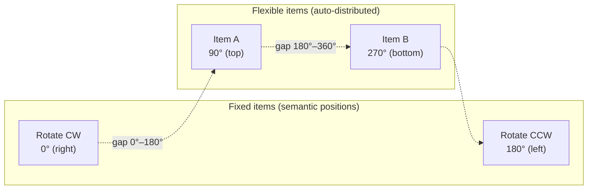
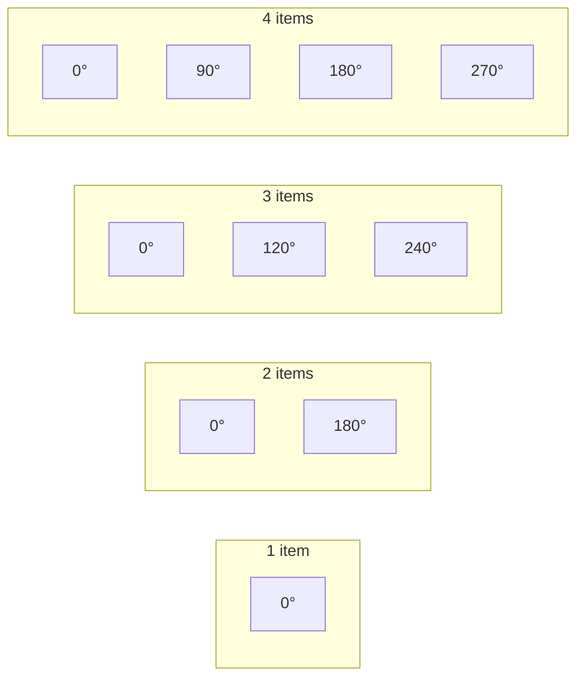
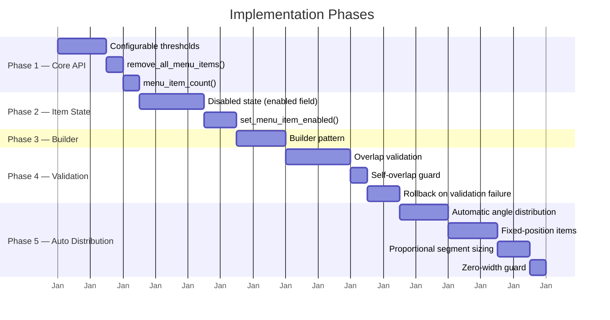

# Planned Improvements

---

## 1. Goal and Motivation

This document outlines incremental improvements to `smearor-wrot-pie-menu` that extend the existing API without breaking changes.

### Goal

Enhance the pie menu widget with configurable thresholds, disabled state support, convenience methods, a builder pattern, overlap validation, and automatic angle distribution — all while maintaining backward compatibility and following the project's clean code guidelines (AGENTS.md).

### Motivation

The current implementation has several limitations that affect usability and ergonomics:

- **Hardcoded thresholds**: Consumers cannot adjust how aggressively the pie menu opens or closes
- **No disabled state**: Items must be removed entirely to deactivate them
- **No bulk operations**: Clearing or counting items requires manual iteration
- **Verbose construction**: No fluent builder API for ergonomic widget setup
- **No overlap prevention**: Items can visually collide without warning
- **Manual angle management**: Consumers must recalculate all angles when adding/removing items

These improvements make the widget more flexible, safer, and more pleasant to use in production applications.

---

## 2. Current State

The `smearor-wrot-pie-menu` library currently provides:

- **Touch gesture activation**: Pinch-to-zoom opens the menu at scale > 3.5, closes at scale < 0.5 (hardcoded)
- **Rotation gesture**: Two-finger rotation adjusts the ring angle
- **Menu items**: `MenuItem` with `id`, `label`, `icon_name`, `color`, `angle`, `radius`, `event` fields
- **Message passing**: `PieMenuMessage` with `Opened`, `Closed`, `Rotate(f32)`, `Event(String)` variants
- **Hover detection**: Mouse hover highlights the nearest item
- **Click-to-select**: Clicking an item sends `PieMenuMessage::Event`
- **Center close button**: Click the center circle to close the menu
- **GTK4 native**: Built as a proper GTK4 widget with `BinLayout` overlay

### What is Missing

| Feature | Status |
|---------|--------|
| Configurable thresholds | Hardcoded in `widget.rs` |
| Disabled state | Not supported |
| `remove_all_menu_items()` | Not available |
| `menu_item_count()` | Not available |
| Builder pattern | Only `new()` + setters |
| Overlap validation | Not implemented |
| Automatic angle distribution | Not implemented |
| Fixed-position items | Not supported |

---

## 3. Configurable Activation Threshold

### Problem

The pinch-to-zoom activation threshold is hardcoded in `src/overlay_widget/imp/widget.rs`:

```rust
if scale > 3.5 && !is_open {
    let _ = widget.show_pie_menu();
}
```

Consumers cannot adjust how aggressively the pie menu opens.

### Proposal

Add a setter on `PieMenuOverlayWidget`:

```rust
pub trait PieMenuControlHandler {
    fn set_activation_threshold(&self, threshold: f64);
    fn activation_threshold(&self) -> f64;
}
```

Store the value using the [`atomic_float`](https://crates.io/crates/atomic_float) crate (`AtomicF64`) in `PieMenuOverlayWidgetImpl`. Default: `3.5`.

```toml
[dependencies]
atomic_float = "1.0"
```

```rust
use atomic_float::AtomicF64;

pub struct PieMenuOverlayWidgetImpl {
    // ... existing fields ...
    pub(crate) activation_threshold: AtomicF64,
}
```

### Affected Files

- `src/overlay_widget/imp/widget.rs` — replace hardcoded `3.5` with stored value
- `src/overlay_widget/control/handler.rs` — add trait methods
- `src/overlay_widget/imp/control/handler.rs` — implement storage
- `src/overlay_widget/imp/widget.rs` (struct) — add `activation_threshold: AtomicF64` field
- `Cargo.toml` — add `atomic_float` dependency

---

## 4. Configurable Deactivation Threshold

### Problem

The pinch-out deactivation threshold is likewise hardcoded:

```rust
if scale < 0.5 && is_open {
    let _ = widget.hide_pie_menu();
}
```

### Proposal

Add a setter on `PieMenuOverlayWidget`:

```rust
pub trait PieMenuControlHandler {
    fn set_deactivation_threshold(&self, threshold: f64);
    fn deactivation_threshold(&self) -> f64;
}
```

Store the value using `AtomicF64` from the `atomic_float` crate in `PieMenuOverlayWidgetImpl`. Default: `0.5`.

### Affected Files

Same as activation threshold.

---

## 5. Disabled State for Menu Items

### Problem

All menu items are always active. There is no way to disable an item without removing it.

### Proposal

Add an `enabled` field to `MenuItem`:

```rust
#[derive(Debug, Clone, Serialize, Deserialize, TypedBuilder)]
pub struct MenuItem {
    // ... existing fields ...
    /// Whether the menu item is enabled (clickable). Defaults to `true`.
    #[builder(default = true)]
    pub enabled: bool,
}
```

### Error Type

```rust
/// Error returned when setting the enabled state of a menu item that does not exist.
#[derive(Debug, Clone, thiserror::Error)]
pub enum SetMenuItemEnabledError {
    /// No menu item with the given id was found.
    #[error("Menu item not found: {id}")]
    NotFound { id: String },
}
```

### Rendering

In `src/menu_widget/imp/widget.rs` (draw method):
- When `enabled == false`: render icon and label at reduced opacity (e.g. 0.3)
- Skip hover highlight for disabled items
- Do not send `PieMenuMessage::Event` on click

### Click Handling

In the click handler (`src/overlay_widget/imp/widget.rs`), check `enabled` before dispatching the event:

```rust
if !menu_item.enabled {
    return;
}
```

### API

Add a runtime toggle:

```rust
pub trait PieMenuMenuItemHandler {
    /// Sets the enabled state of a menu item and triggers a redraw.
    /// When `enabled` is `false`, the item is rendered at reduced opacity
    /// and click events are suppressed.
    fn set_menu_item_enabled(&self, id: &str, enabled: bool) -> Result<(), SetMenuItemEnabledError>;
}
```

### UI Invalidation

After updating the `enabled` field, the implementation must call `queue_draw()` on the `PieMenuWidget` so that the disabled state (reduced opacity, no hover highlight) is immediately reflected visually:

```rust
fn set_menu_item_enabled(&self, id: &str, enabled: bool) -> Result<(), SetMenuItemEnabledError> {
    let mut menu_item = self.menu.get_mut(id)
        .ok_or(SetMenuItemEnabledError::NotFound { id: id.to_string() })?;
    menu_item.enabled = enabled;
    drop(menu_item);

    if let Some(pie_menu_widget) = self.pie_menu_widget.get() {
        pie_menu_widget.queue_draw();
    }

    Ok(())
}
```

### Affected Files

- `src/menu/item.rs` — add `enabled` field
- `src/menu_widget/imp/widget.rs` — render disabled state, skip hover
- `src/overlay_widget/imp/widget.rs` — skip event dispatch for disabled items
- `src/menu_widget/menu_item/handler.rs` — add `set_menu_item_enabled` to trait
- `src/menu_widget/imp/menu_item/handler.rs` — implement

---

## 6. remove_all_menu_items()

### Problem

There is no way to clear all menu items at once. Consumers must remove items individually.

### Proposal

Add to `PieMenuMenuItemHandler`:

```rust
pub trait PieMenuMenuItemHandler {
    fn remove_all_menu_items(&self);
}
```

Implementation clears the `DashMap` and queues a redraw.

### Affected Files

- `src/menu_widget/menu_item/handler.rs` — add trait method
- `src/menu_widget/imp/menu_item/handler.rs` — implement

---

## 7. menu_item_count()

### Problem

Consumers cannot query how many items are currently in the menu.

### Proposal

Add to `PieMenuMenuItemHandler`:

```rust
pub trait PieMenuMenuItemHandler {
    fn menu_item_count(&self) -> usize;
}
```

Implementation returns `self.menu.len()`.

### Affected Files

- `src/menu_widget/menu_item/handler.rs` — add trait method
- `src/menu_widget/imp/menu_item/handler.rs` — implement

---

## 8. Builder Pattern for PieMenuOverlayWidget

### Problem

`PieMenuOverlayWidget` is constructed via `new()` and then configured via separate setter calls. A fluent builder API would improve ergonomics.

### Proposal

Add builder-style methods to `PieMenuOverlayWidget`:

```rust
impl PieMenuOverlayWidget {
    pub fn new(child: Option<&Widget>) -> Self { /* ... */ }

    pub fn with_message_sender(self, sender: Sender<PieMenuMessage>) -> Self {
        self.set_message_sender(sender);
        self
    }

    pub fn with_activation_threshold(self, threshold: f64) -> Self {
        self.set_activation_threshold(threshold);
        self
    }

    pub fn with_deactivation_threshold(self, threshold: f64) -> Self {
        self.set_deactivation_threshold(threshold);
        self
    }

    pub fn with_menu_item(self, item: MenuItem) -> Result<Self, AddMenuItemError> {
        self.add_menu_item(item)?;
        Ok(self)
    }
}
```

### Usage

```rust
let overlay = PieMenuOverlayWidget::new(Some(&child))
    .with_message_sender(sender)
    .with_activation_threshold(2.5)
    .with_menu_item(MenuItem::builder().id("rotate-cw").label("Rotate CW").build())?;
```

### Affected Files

- `src/overlay_widget/widget.rs` — add builder methods

---

## 9. Item Overlap Validation

### Problem

When too many items are placed on the ring, their icons/labels overlap visually. There is no validation or warning.

### Proposal

Add validation in `add_menu_item`:

```rust
/// Error returned when adding a menu item fails.
#[derive(Debug, Clone, thiserror::Error)]
pub enum AddMenuItemError {
    // ... existing variants ...
    /// The new item overlaps with an existing item on the ring.
    #[error("Menu item '{id}' overlaps with existing item '{overlapping_with}'")]
    ItemOverlap { id: String, overlapping_with: String },
}
```

Calculate overlap based on:
- Item radius (icon size)
- Item angle
- Ring radius (distance from center)

If two items' bounding circles overlap, return an error.

### Transactional Safety (Rollback)

When `add_menu_item` or `add_menu_item_auto` inserts an item into the internal `DashMap` and the subsequent overlap validation fails, the item must be removed to prevent data inconsistency. The implementation must roll back the insertion on error:

```rust
pub fn add_menu_item(&self, item: MenuItem) -> Result<(), AddMenuItemError> {
    self.menu.insert(item.id.clone(), item.clone());

    if let Err(error) = self.validate_no_overlap(&item, self.ring_radius()) {
        self.menu.remove(&item.id);
        return Err(error);
    }

    if let Some(pie_menu_widget) = self.pie_menu_widget.get() {
        pie_menu_widget.queue_draw();
    }

    Ok(())
}
```

For `add_menu_item_auto`, the rollback must also undo any angle changes applied by `redistribute_angles` to previously existing items. The snapshot must be taken **before** the insertion to capture the original state. If an item with the same id already exists, the rollback must restore the previous item rather than remove it:

```rust
pub fn add_menu_item_auto(&self, item: MenuItem) -> Result<(), AddMenuItemError> {
    // 1. Capture previous state BEFORE modification
    let previous_item = self.menu.get(&item.id).map(|entry| entry.value().clone());
    let angle_snapshot: Vec<(String, f32)> = self.menu.iter()
        .map(|entry| (entry.key().clone(), entry.value().angle))
        .collect();

    // 2. Insert and redistribute
    self.menu.insert(item.id.clone(), item.clone());
    self.redistribute_angles();

    // 3. Validate after redistribution (see "Reihenfolge der Validierung")
    if let Err(error) = self.validate_all_no_overlap(self.ring_radius()) {
        // 4. Rollback: restore previous item on overwrite, otherwise remove
        if let Some(previous) = previous_item {
            self.menu.insert(item.id.clone(), previous);
        } else {
            self.menu.remove(&item.id);
        }

        // 5. Restore all angles to their pre-redistribution values
        for (id, angle) in &angle_snapshot {
            if let Some(mut entry) = self.menu.get_mut(id) {
                entry.angle = *angle;
            }
        }
        return Err(error);
    }

    if let Some(pie_menu_widget) = self.pie_menu_widget.get() {
        pie_menu_widget.queue_draw();
    }

    Ok(())
}
```

### Validation Logic

Implement as a method on `Menu` rather than a free function, following the project convention of preferring trait/type implementations over standalone functions:

```rust
impl Menu {
    /// Checks whether the new item overlaps with any existing item on the ring.
    /// Returns `Ok(())` if `ring_radius` is zero (e.g. during initialization).
    fn validate_no_overlap(&self, new_item: &MenuItem, ring_radius: f32) -> Result<(), AddMenuItemError> {
        if ring_radius == 0.0 {
            return Ok(());
        }
        let new_angle_rad = new_item.angle.to_radians();
        let new_position = (new_angle_rad.cos(), new_angle_rad.sin());
        for entry in self.iter() {
            let existing_item = entry.value();
            if existing_item.id == new_item.id {
                continue;
            }
            let existing_angle_rad = existing_item.angle.to_radians();
            let existing_position = (existing_angle_rad.cos(), existing_angle_rad.sin());
            let distance = ((new_position.0 - existing_position.0).powi(2)
                + (new_position.1 - existing_position.1).powi(2))
                .sqrt();
            let min_distance = (new_item.radius.unwrap_or(DEFAULT_MENU_ITEM_RADIUS)
                + existing_item.radius.unwrap_or(DEFAULT_MENU_ITEM_RADIUS))
                / ring_radius;
            if distance < min_distance {
                return Err(AddMenuItemError::ItemOverlap {
                    id: new_item.id.clone(),
                    overlapping_with: existing_item.id.clone(),
                });
            }
        }
        Ok(())
    }

    /// Validates that no items in the menu overlap with each other.
    /// Used after `redistribute_angles` in `add_menu_item_auto` to check
    /// the full configuration, since all flexible items may have shifted.
    fn validate_all_no_overlap(&self, ring_radius: f32) -> Result<(), AddMenuItemError> {
        for item in self.iter() {
            self.validate_no_overlap(item.value(), ring_radius)?;
        }
        Ok(())
    }
}
```

### Affected Files

- `src/menu_widget/menu_item/handler.rs` — add error variant
- `src/menu_widget/imp/menu_item/handler.rs` — implement validation
- `src/menu_widget/menu_item/error.rs` — add `ItemOverlap` variant

---

## 10. Automatic Angle Distribution

### Problem

Each `MenuItem` requires a manual `angle` field. When adding/removing items, consumers must recalculate all angles.

### Proposal

Add an auto-distribution mode:

```rust
pub trait PieMenuMenuItemHandler {
    /// Adds a menu item with an automatically calculated angle.
    /// The angle is distributed evenly across 360° based on the current item count.
    fn add_menu_item_auto(&self, menu_item: MenuItem) -> Result<(), AddMenuItemError>;
}
```

### Behavior

- When `add_menu_item_auto` is called, the `angle` field is ignored
- The angle is computed as: `360° * index / total_count`
- All existing items are re-distributed to maintain even spacing
- **Overlap validation must run after `redistribute_angles`**, not before — flexible items shift their angles during redistribution, so pre-redistribution positions are stale and would produce false positives/negatives

### Fixed-Position Items

Some menu items have a **semantic position** that must not change when other items are added or removed. For example:

- **Rotate CCW / Back** — semantically placed on the left (180°)
- **Rotate CW / Forward** — semantically placed on the right (0°)

To support this, add a `fixed_position` field to `MenuItem`:

```rust
/// A single menu item with configurable content, position, and event binding.
#[derive(Debug, Clone, Serialize, Deserialize, TypedBuilder)]
pub struct MenuItem {
    // ... existing fields ...

    /// When `true`, the item's `angle` is treated as a fixed semantic position.
    /// Auto-distribution will not re-assign this item's angle.
    /// The remaining items are distributed in the gaps between fixed items.
    #[builder(default = false)]
    pub fixed_position: bool,
}
```

### Distribution Algorithm

When `add_menu_item_auto` is called:

1. Collect all items with `fixed_position == true` — these keep their `angle` unchanged.
2. Sort fixed items by their angle to define anchor points.
3. Compute the angular width of each segment (gap between consecutive fixed items, including wrap-around).
4. Distribute the remaining (non-fixed) items **proportionally** to the angular width of each segment — wider segments receive more items.
5. Within each segment, items are spaced evenly.
6. If no fixed items exist, distribute all items evenly across 360°.

```rust
impl Menu {
    /// Redistributes non-fixed items proportionally in the gaps between fixed items.
    /// Wider angular segments receive proportionally more items.
    fn redistribute_angles(&self) {
        let items: Vec<MenuItem> = self.iter().map(|e| e.value().clone()).collect();
        let fixed: Vec<&MenuItem> = items.iter().filter(|item| item.fixed_position).collect();
        let flexible: Vec<&MenuItem> = items.iter().filter(|item| !item.fixed_position).collect();

        if fixed.is_empty() {
            // Evenly distribute all items across 360°
            let total = items.len() as f32;
            for (index, item) in items.iter().enumerate() {
                let angle = 360.0 * index as f32 / total;
                self.update_angle(&item.id, angle);
            }
            return;
        }

        // Normalize fixed item angles to [0.0, 360.0) before sorting
        // to prevent negative segment widths or incorrect arc lengths
        let mut fixed_sorted: Vec<MenuItem> = fixed.into_iter().cloned().collect();
        for item in &mut fixed_sorted {
            item.angle = item.angle.rem_euclid(360.0);
        }
        fixed_sorted.sort_by(|a, b| a.angle.partial_cmp(&b.angle).unwrap_or(Ordering::Equal));

        // Compute segment widths (including wrap-around)
        let segment_count = fixed_sorted.len();
        let mut segments: Vec<(f32, f32)> = Vec::with_capacity(segment_count);
        for window in fixed_sorted.windows(2) {
            segments.push((window[0].angle, window[1].angle));
        }
        // Wrap-around segment: last fixed → first fixed + 360°
        if let (Some(first), Some(last)) = (fixed_sorted.first(), fixed_sorted.last()) {
            segments.push((last.angle, first.angle + 360.0));
        }

        let total_width: f32 = segments.iter().map(|(start, end)| end - start).sum();

        // Guard against zero total width (e.g. all fixed items share the same angle)
        if total_width == 0.0 {
            // Fallback: distribute flexible items evenly across 360°
            let flexible_count = flexible.len() as f32;
            for (index, item) in flexible.iter().enumerate() {
                let angle = 360.0 * index as f32 / flexible_count;
                self.update_angle(&item.id, angle);
            }
            return;
        }

        let flexible_count = flexible.len();

        // Proportional allocation: each segment gets items proportional to its angular width.
        // Uses the largest remainder method to ensure all items are distributed.
        let mut allocations: Vec<usize> = segments
            .iter()
            .map(|(start, end)| {
                let width = end - start;
                ((flexible_count as f32 * width / total_width).floor() as usize)
            })
            .collect();

        // Distribute remaining items via largest remainder method
        let allocated: usize = allocations.iter().sum();
        let remainder = flexible_count.saturating_sub(allocated);
        if remainder > 0 {
            let mut remainders: Vec<(usize, f32)> = segments
                .iter()
                .enumerate()
                .map(|(index, (start, end))| {
                    let width = end - start;
                    let fractional = flexible_count as f32 * width / total_width
                        - (flexible_count as f32 * width / total_width).floor();
                    (index, fractional)
                })
                .collect();
            remainders.sort_by(|a, b| b.1.partial_cmp(&a.1).unwrap_or(Ordering::Equal));
            for (index, _) in remainders.iter().take(remainder) {
                allocations[*index] += 1;
            }
        }

        // Place flexible items within each segment
        let mut flexible_index = 0;
        for (segment_index, (start_angle, end_angle)) in segments.iter().enumerate() {
            let count = allocations[segment_index];
            if count == 0 {
                continue;
            }
            let segment_size = end_angle - start_angle;
            for offset in 0..count {
                let angle = start_angle + segment_size * (offset + 1) as f32 / (count + 1) as f32;
                let item = &flexible[flexible_index];
                self.update_angle(&item.id, angle.rem_euclid(360.0));
                flexible_index += 1;
            }
        }
    }
}
```

### Example



With two fixed items at 0° and 180°, two flexible items are placed at 90° and 270° — evenly distributed in the two gaps.

### Example



### Affected Files

- `src/menu/item.rs` — add `fixed_position` field to `MenuItem`
- `src/menu_widget/menu_item/handler.rs` — add trait method
- `src/menu_widget/imp/menu_item/handler.rs` — implement auto-distribution logic with fixed-position awareness

---

## 11. Phase Plan

The improvements are grouped into phases by dependency and complexity. Each phase can be implemented and shipped independently.



### Phase 1 — Core API Extensions

Low-risk, additive changes with no impact on existing behavior.

- Configurable activation/deactivation thresholds
- `remove_all_menu_items()`
- `menu_item_count()`

### Phase 2 — Item State Management

Adds the `enabled` field and runtime toggle. Requires `queue_draw()` for visual feedback.

- `enabled` field on `MenuItem`
- `set_menu_item_enabled()` with UI invalidation
- Disabled rendering (reduced opacity, no hover, no click)

### Phase 3 — Builder Pattern

Ergonomic improvement, depends on Phase 1 setters being available.

- `with_message_sender()`, `with_activation_threshold()`, `with_deactivation_threshold()`
- `with_menu_item()` returning `Result<Self, AddMenuItemError>`

### Phase 4 — Overlap Validation

Depends on Phase 2 (items need `radius` field). Introduces error handling and rollback.

- `AddMenuItemError::ItemOverlap` variant
- `validate_no_overlap()` with self-overlap guard and zero-radius guard
- `validate_all_no_overlap()` for post-redistribution checks
- Transactional rollback in `add_menu_item()`

### Phase 5 — Automatic Angle Distribution

Most complex phase, depends on Phase 4 for post-distribution validation.

- `add_menu_item_auto()` trait method
- `redistribute_angles()` with proportional segment sizing
- `fixed_position` field for semantic anchors
- Angle normalization, zero-width guard, rollback with angle snapshot

---

## 12. Unit Tests

All tests are inline (`#[cfg(test)]` module in the respective source files) per AGENTS.md testing requirements.

### Threshold Tests (`src/overlay_widget/imp/widget.rs`)

- `test_default_activation_threshold` — verifies default value is `3.5`
- `test_default_deactivation_threshold` — verifies default value is `0.5`
- `test_set_activation_threshold` — setter updates the stored value
- `test_set_deactivation_threshold` — setter updates the stored value
- `test_activation_threshold_triggers_open` — pie menu opens when scale exceeds threshold
- `test_deactivation_threshold_triggers_close` — pie menu closes when scale drops below threshold

### Disabled State Tests (`src/menu/item.rs`, `src/menu_widget/imp/menu_item/handler.rs`)

- `test_menu_item_enabled_by_default` — `enabled` field defaults to `true`
- `test_set_menu_item_enabled_existing` — toggling enabled state on an existing item
- `test_set_menu_item_enabled_not_found` — returns `SetMenuItemEnabledError::NotFound`
- `test_disabled_item_renders_at_reduced_opacity` — draw method uses 0.3 opacity when disabled
- `test_disabled_item_does_not_send_event` — click on disabled item does not dispatch `PieMenuMessage::Event`

### Convenience Method Tests (`src/menu_widget/imp/menu_item/handler.rs`)

- `test_remove_all_menu_items` — clears all items, `menu_item_count()` returns 0
- `test_remove_all_menu_items_empty` — no-op when menu is already empty
- `test_menu_item_count` — returns correct count after adding/removing items

### Overlap Validation Tests (`src/menu_widget/imp/menu_item/handler.rs`)

- `test_validate_no_overlap_no_items` — `Ok(())` when menu is empty
- `test_validate_no_overlap_zero_ring_radius` — returns `Ok(())` when `ring_radius == 0.0`
- `test_validate_no_overlap_self` — item does not overlap with itself
- `test_validate_no_overlap_distant_items` — `Ok(())` when items are far apart
- `test_validate_no_overlap_overlapping_items` — returns `ItemOverlap` error
- `test_validate_all_no_overlap` — full validation across all items
- `test_add_menu_item_rollback_on_overlap` — item is removed from `DashMap` when validation fails

### Auto Distribution Tests (`src/menu_widget/imp/menu_item/handler.rs`)

- `test_redistribute_no_fixed_items` — all items evenly distributed across 360°
- `test_redistribute_two_fixed_items` — flexible items placed proportionally in gaps
- `test_redistribute_all_fixed_same_angle` — zero-width guard falls back to even distribution
- `test_redistribute_negative_angle_normalized` — fixed item at -45° is normalized to 315°
- `test_redistribute_angle_above_360_normalized` — fixed item at 390° is normalized to 30°
- `test_add_menu_item_auto_rollback` — angle snapshot is restored on validation failure
- `test_fixed_position_not_reassigned` — fixed item angle unchanged after redistribution
- `test_proportional_distribution_uneven_gaps` — wider segments receive more items

---

## 13. README.md Feature List Update

After implementing all phases, update the **Features** section in `README.md` to reflect the new capabilities:

```markdown
## Features

- **Touch gesture activation**: Opens on pinch-to-zoom (configurable threshold, default 3.5), closes on pinch-out (configurable threshold, default 0.5)
- **Rotation gesture**: Rotate the menu ring with a two-finger rotation gesture
- **Configurable menu items**: Add/remove items programmatically with custom icons, colors, angles, and events
- **Disabled state**: Disable individual menu items (reduced opacity, no click, no hover)
- **Builder pattern**: Fluent API for ergonomic widget construction (`with_message_sender()`, `with_menu_item()`, etc.)
- **Automatic angle distribution**: Auto-distribute items evenly across the ring with `add_menu_item_auto()`
- **Fixed-position items**: Pin semantically positioned items (e.g. "Rotate CW" at 0°) that resist redistribution
- **Overlap validation**: Prevents visually overlapping items with automatic rollback on failure
- **Convenience methods**: `remove_all_menu_items()`, `menu_item_count()`, `set_menu_item_enabled()`
- **Hover detection**: Mouse hover highlights the nearest menu item
- **Click-to-select**: Click a menu item to trigger its event
- **Center close button**: Click the center circle to close the menu
- **GTK4 native**: Built as a proper GTK4 widget with `BinLayout` overlay
```

Also update the **PieMenuMessage** section to include `Opened` and `Closed`:

```markdown
### `PieMenuMessage`

Messages sent from the pie menu to the consumer:
- `Opened` — the pie menu was opened
- `Closed` — the pie menu was closed
- `Rotate(f32)` — rotation delta in degrees from the rotation gesture
- `Event(String)` — the event name of the clicked menu item
```

---

## 14. Book Update

The mdBook in `book/src/` needs the following updates:

### SUMMARY.md — New Chapters

Add new chapters for the implemented features:

```markdown
# Summary

- [Introduction](introduction.md)
- [Quick Start](quickstart.md)
- [The PieMenuOverlayWidget](widget.md)
    - [MenuItem](menu_item.md)
    - [PieMenuMessage](message.md)
    - [API Reference](api.md)
    - [Thresholds](thresholds.md)
    - [Disabled State](disabled_state.md)
    - [Builder Pattern](builder_pattern.md)
    - [Auto Distribution](auto_distribution.md)
    - [Overlap Validation](overlap_validation.md)
- [Architecture](architecture.md)
- [Examples](examples.md)
```

### New Pages

- **`book/src/thresholds.md`** — Configurable activation/deactivation thresholds, `AtomicF64` usage, examples
- **`book/src/disabled_state.md`** — `enabled` field, `set_menu_item_enabled()`, visual rendering, `queue_draw()` invalidation
- **`book/src/builder_pattern.md`** — Fluent builder API, `with_*` methods, `Result`-returning `with_menu_item()`
- **`book/src/auto_distribution.md`** — `add_menu_item_auto()`, `fixed_position`, proportional distribution algorithm, Mermaid diagrams
- **`book/src/overlap_validation.md`** — `AddMenuItemError::ItemOverlap`, validation logic, rollback, `validate_all_no_overlap()`

### Updated Pages

- **`book/src/menu_item.md`** — Document `enabled` and `fixed_position` fields
- **`book/src/message.md`** — Document `Opened` and `Closed` variants
- **`book/src/widget.md`** — Document configurable thresholds and builder pattern
- **`book/src/api.md`** — Add `remove_all_menu_items()`, `menu_item_count()`, `set_menu_item_enabled()`, `add_menu_item_auto()`
- **`book/src/quickstart.md`** — Update Quick Start example to use builder pattern

---

## 15. Limitations

This concept paper describes improvements to the existing API. The following limitations and non-goals should be considered during implementation:

### Non-Goals

- **Submenu support**: Nested pie menus are described in a separate concept paper (`SUBMENUS.md`)
- **Custom widget content**: Embedding arbitrary GTK4 widgets as item content is described in `CUSTOM_WIDGET.md`
- **Advanced input handling**: Keyboard, mouse wheel, and controller navigation are described in `INPUT_HANDLING.md`
- **Animation transitions**: Smooth angle transitions during redistribution are not part of this concept

### Technical Limitations

- **`AtomicF64` dependency**: The `atomic_float` crate is required since `std` does not provide atomic float types. This adds a third-party dependency.
- **Overlap validation is O(n²)**: `validate_all_no_overlap` iterates all items against each other. For typical pie menus (≤ 12 items) this is negligible, but very large menus may need optimization.
- **Proportional distribution uses `f32`**: Floating-point rounding in the largest remainder method may produce sub-optimal allocation for edge cases with many items and very uneven segment widths.
- **Rollback is not atomic across threads**: The `DashMap` operations in the rollback path (remove + angle restore) are individual operations. Concurrent access during rollback could observe an intermediate state. Consumers should avoid concurrent modifications during `add_menu_item_auto`.
- **`fixed_position` is per-item, not per-slot**: Two fixed items at the same angle will collapse the segment between them to zero width. The zero-width guard handles this, but the visual result may be undesirable.

### Backward Compatibility

All improvements are additive — no existing API signatures change. The `enabled` and `fixed_position` fields default to `true` and `false` respectively, preserving current behavior for existing consumers.

---

## 16. Summary

This concept paper outlines 8 incremental improvements to `smearor-wrot-pie-menu`, organized into 5 implementation phases:

| Phase | Improvements | Complexity |
|-------|-------------|------------|
| 1 — Core API | Configurable thresholds, `remove_all_menu_items()`, `menu_item_count()` | Low |
| 2 — Item State | Disabled state with `set_menu_item_enabled()` and UI invalidation | Medium |
| 3 — Builder | Fluent builder pattern with `with_*` methods | Low |
| 4 — Validation | Overlap validation with self-overlap guard, zero-radius guard, and rollback | Medium |
| 5 — Auto Distribution | `add_menu_item_auto()` with fixed-position items, proportional distribution, angle normalization, zero-width guard, and rollback | High |

### Key Design Decisions

- **`atomic_float` crate** for thread-safe threshold storage (`AtomicF64`)
- **`thiserror` error types** for all fallible operations (`AddMenuItemError`, `SetMenuItemEnabledError`)
- **Proportional segment distribution** using the largest remainder method for fair allocation
- **Transactional rollback** with angle snapshots to prevent data inconsistency on validation failure
- **Fixed-position items** for semantically anchored menu entries (e.g. "Rotate CW" at 0°)
- **Panic-free code** throughout, per AGENTS.md guidelines

### Expected Outcome

After implementation, consumers can:

1. Configure activation/deactivation sensitivity at runtime
2. Disable items without removing them
3. Clear and count items in a single call
4. Build widgets fluently with `with_*` methods
5. Rely on automatic overlap prevention
6. Auto-distribute items with optional fixed-position anchors

All changes are backward compatible and covered by 28 inline unit tests.
