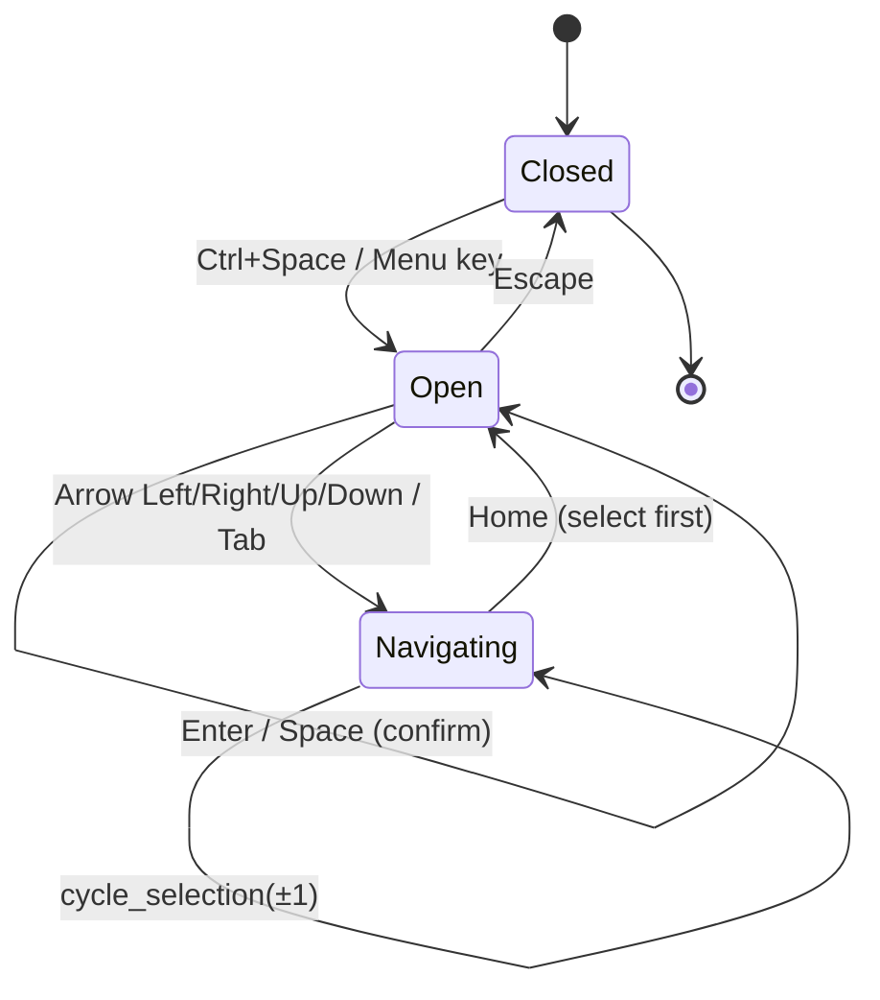
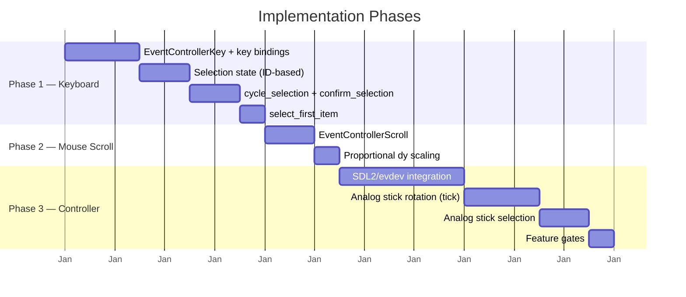

# Input Handling — Keyboard, Mouse, and Controller Support

---

## 1. Goal and Motivation

This document describes the concept for alternative input methods beyond touch gestures.

### Goal

Add keyboard, mouse scroll, and game controller support to the pie menu widget, making it usable on desktop systems and accessible to users who cannot use touch input. All input methods are opt-in via feature flags to keep the default dependency surface minimal.

### Motivation

The pie menu is currently only operable via pinch-to-zoom and rotation gestures, which require a touchscreen. This limits accessibility and desktop usability:

- **No keyboard navigation**: Users without touchscreens cannot open, navigate, or confirm selections
- **No mouse scroll rotation**: Desktop users must use the two-finger rotation gesture, which requires a touchpad
- **No controller support**: Game controller users have no way to interact with the menu

These improvements make the widget accessible on desktop systems and for users with motor impairments.

---

## 2. Current State

The `smearor-wrot-pie-menu` library currently provides:

- **Touch gesture activation**: Pinch-to-zoom opens/closes the menu (configurable thresholds)
- **Rotation gesture**: Two-finger rotation adjusts the ring angle
- **Hover detection**: Mouse hover highlights the nearest item
- **Click-to-select**: Clicking an item sends `PieMenuMessage::Event`

### What is Missing

| Feature | Status | Extra Dependencies |
|---------|--------|--------------------|
| Keyboard navigation | Not implemented | None (GTK4 native) |
| Mouse scroll rotation | Not implemented | None (GTK4 native) |
| Controller support | Not implemented | `sdl2` or `evdev` (feature-gated) |

### Feature Flag Strategy

Keyboard and mouse scroll use GTK4's built-in `EventControllerKey` and `EventControllerScroll` — no extra dependencies. Controller support requires either `sdl2` or `evdev`, which are heavy dependencies and therefore gated behind explicit feature flags:

```toml
[features]
default = []
keyboard = []
mouse-scroll = []
controller-sdl2 = ["dep:sdl2"]
controller-evdev = ["dep:evdev"]
```

Consumers enable only the input methods they need. The default build includes no input handling beyond touch gestures.

---

## 3. Keyboard Navigation

### Concept

The pie menu can be opened, navigated, and closed entirely with the keyboard.



### Key Bindings

| Key | Action |
|-----|--------|
| `Ctrl+Space` / `Menu` key | Open the pie menu (when closed) |
| `Escape` | Close the pie menu (when open) |
| `Arrow Left` / `Arrow Right` | Cycle selection counter-clockwise / clockwise through items |
| `Arrow Up` / `Arrow Down` | Alternative cycle direction (maps to CCW / CW) |
| `Enter` / `Space` | Confirm selection of the highlighted item (only when open) |
| `Home` | Select the first item (angle 0°) |
| `Tab` | Cycle to next item (alternative to arrow keys) |

> **Important**: `Enter` and `Space` only trigger actions when the pie menu is open. When the menu is closed, these keys pass through to child widgets (`Propagation::Proceed`) so that text fields, buttons, and other interactive elements remain fully functional. Opening the menu requires `Ctrl+Space` or the dedicated `Menu` key to avoid blocking normal keyboard input.

### Implementation

Add a `EventControllerKey` to `PieMenuOverlayWidget`:

```rust
let key_controller = EventControllerKey::new();
key_controller.set_propagation_phase(PropagationPhase::Capture);

let widget_weak = widget.downgrade();
key_controller.connect_key_pressed(move |_controller, keyval, _keycode, state| {
    let Some(widget) = widget_weak.upgrade() else {
        return glib::Propagation::Proceed;
    };

    match keyval {
        // Open menu via Ctrl+Space or Menu key (does not block child widgets)
        Key::space if state.contains(gdk::ModifierType::CONTROL_MASK) => {
            if !widget.is_pie_menu_open() {
                let _ = widget.show_pie_menu();
                glib::Propagation::Stop
            } else {
                glib::Propagation::Proceed
            }
        }
        Key::Menu => {
            if !widget.is_pie_menu_open() {
                let _ = widget.show_pie_menu();
                glib::Propagation::Stop
            } else {
                glib::Propagation::Proceed
            }
        }
        // Confirm selection only when menu is open; otherwise pass through
        Key::Return | Key::space => {
            if widget.is_pie_menu_open() {
                widget.confirm_selection();
                glib::Propagation::Stop
            } else {
                glib::Propagation::Proceed
            }
        }
        Key::Escape => {
            if widget.is_pie_menu_open() {
                let _ = widget.hide_pie_menu();
                glib::Propagation::Stop
            } else {
                glib::Propagation::Proceed
            }
        }
        Key::Left | Key::Down => {
            if widget.is_pie_menu_open() {
                widget.cycle_selection(-1);
                glib::Propagation::Stop
            } else {
                glib::Propagation::Proceed
            }
        }
        Key::Right | Key::Up => {
            if widget.is_pie_menu_open() {
                widget.cycle_selection(1);
                glib::Propagation::Stop
            } else {
                glib::Propagation::Proceed
            }
        }
        Key::Home => {
            if widget.is_pie_menu_open() {
                widget.select_first_item();
                glib::Propagation::Stop
            } else {
                glib::Propagation::Proceed
            }
        }
        Key::Tab => {
            if widget.is_pie_menu_open() {
                widget.cycle_selection(1);
                glib::Propagation::Stop
            } else {
                glib::Propagation::Proceed
            }
        }
        _ => glib::Propagation::Proceed,
    }
});

widget.add_controller(key_controller);
```

### Selection State

Add internal state for keyboard-driven selection. The selection stores the **item ID** (`Option<String>`) rather than a numeric index, because `DashMap` iteration order is non-deterministic and index-based selection would jump unpredictably when items are added or removed:

```rust
/// Internal state for the pie menu overlay widget implementation.
pub struct PieMenuOverlayWidgetImpl {
    // ... existing fields ...

    /// ID of the currently keyboard-selected item, if any.
    /// Stored as a string ID (not an index) to remain stable across
    /// DashMap insertion/removal order changes.
    pub(crate) keyboard_selection: RefCell<Option<String>>,
}
```

### Navigation Logic

`cycle_selection` sorts items by angle before iterating, ensuring deterministic clockwise/counter-clockwise navigation:

```rust
/// Cycles the keyboard selection by `direction` (-1 for CCW, +1 for CW).
/// Items are sorted by angle to ensure deterministic navigation order.
pub fn cycle_selection(&self, direction: i32) {
    let mut items: Vec<_> = self.menu.iter().map(|entry| entry.value().clone()).collect();
    if items.is_empty() {
        return;
    }

    // Sort by angle for deterministic clockwise ordering.
    // `total_cmp` is used instead of `partial_cmp` to avoid NaN edge cases
    // and to comply with AGENTS.md panic-free guidelines.
    items.sort_by(|a, b| a.angle.total_cmp(&b.angle));

    let current_id = self.keyboard_selection.borrow().clone();
    let current_index = current_id.and_then(|id| items.iter().position(|item| item.id == id));

    let next_index = match current_index {
        Some(index) => (index as i32 + direction).rem_euclid(items.len() as i32) as usize,
        None => 0,
    };

    *self.keyboard_selection.borrow_mut() = Some(items[next_index].id.clone());

    if let Some(pie_menu_widget) = self.pie_menu_widget.get() {
        pie_menu_widget.queue_draw();
    }
}

/// Selects the first item (smallest angle, typically 0°).
pub fn select_first_item(&self) {
    let mut items: Vec<_> = self.menu.iter().map(|entry| entry.value().clone()).collect();
    if items.is_empty() {
        return;
    }

    items.sort_by(|a, b| a.angle.total_cmp(&b.angle));
    *self.keyboard_selection.borrow_mut() = Some(items[0].id.clone());

    if let Some(pie_menu_widget) = self.pie_menu_widget.get() {
        pie_menu_widget.queue_draw();
    }
}
```

### Confirmation Logic

`confirm_selection` sends `PieMenuMessage::Event` via the `PieMenuMessageSender` trait, which is already implemented by `PieMenuOverlayWidget`:

```rust
/// Confirms the current keyboard selection by sending `PieMenuMessage::Event`
/// for the selected item. Does nothing if no item is selected or if the
/// selected item is disabled.
pub fn confirm_selection(&self) {
    let selected_id = self.keyboard_selection.borrow().clone();
    if let Some(id) = selected_id {
        if let Some(item) = self.menu.get(&id) {
            if !item.enabled {
                return;
            }
            let event = item.event.clone();
            self.send_message(PieMenuMessage::Event(event));
        }
    }
}
```

`send_message` is provided by the `PieMenuMessageSender` trait, which `PieMenuOverlayWidget` implements. No additional trait method needs to be added.

- The selected item is rendered with the same highlight as hover.
- `confirm_selection()` sends `PieMenuMessage::Event` for the selected item's event name.

### Affected Files

- `src/overlay_widget/imp/widget.rs` — add `EventControllerKey`, `keyboard_selection` state
- `src/menu_widget/imp/widget.rs` — render keyboard selection highlight
- `src/overlay_widget/control/handler.rs` — add `cycle_selection`, `select_first_item`, `confirm_selection`

---

## 4. Mouse: Ring Rotation via Scroll Wheel

### Concept

When the pie menu is open, scrolling the mouse wheel rotates the menu ring. This provides an alternative to the two-finger rotation gesture.

### Behavior

| Scroll Direction | Action |
|-----------------|--------|
| Scroll Up (`dy < 0`) | Rotate ring clockwise (proportional to `dy`) |
| Scroll Down (`dy > 0`) | Rotate ring counter-clockwise (proportional to `dy`) |

The rotation delta is scaled directly by `dy`, so high-precision touchpads that emit many small scroll events (e.g. `dy = 0.05`) produce smooth rotation, while discrete mouse wheels with larger `dy` values produce larger steps. The configurable `scroll_rotation_step` acts as a **sensitivity multiplier**, not a fixed step size.

### Implementation

Add a `EventControllerScroll` to `PieMenuOverlayWidget`:

```rust
let scroll_controller = EventControllerScroll::new(EventControllerScrollFlags::VERTICAL);
scroll_controller.set_propagation_phase(PropagationPhase::Capture);

let widget_weak = widget.downgrade();
scroll_controller.connect_scroll(move |_controller, _dx, dy| {
    let Some(widget) = widget_weak.upgrade() else {
        return glib::Propagation::Proceed;
    };

    if !widget.is_pie_menu_open() {
        return glib::Propagation::Proceed;
    }

    let rotation_step = widget.scroll_rotation_step();
    let current_rotation = widget.rotation();
    let new_rotation = current_rotation + (dy as f32 * rotation_step);
    widget.set_rotation(new_rotation.rem_euclid(360.0));

    glib::Propagation::Stop
});

widget.add_controller(scroll_controller);
```

### Configuration

```rust
/// Trait for controlling the pie menu overlay widget.
pub trait PieMenuControlHandler {
    /// Sets the scroll rotation sensitivity multiplier.
    /// The rotation delta is computed as `dy * sensitivity`, so higher
    /// values produce faster rotation. Default: `5.0`.
    fn set_scroll_rotation_step(&self, sensitivity: f32);

    /// Returns the current scroll rotation sensitivity multiplier.
    fn scroll_rotation_step(&self) -> f32;
}
```

Default: `5.0` (sensitivity multiplier). With a discrete mouse wheel tick (`dy ≈ 1.0`), this yields ~5° per tick. With a high-precision touchpad (`dy ≈ 0.05`), each event yields ~0.25° for smooth rotation.

### Affected Files

- `src/overlay_widget/imp/widget.rs` — add `EventControllerScroll`
- `src/overlay_widget/control/handler.rs` — add `set_scroll_rotation_step`

---

## 5. Controller Support

### Concept

The pie menu can be navigated with a game controller via GTK4's `EventControllerMotion` and the Linux input subsystem (evdev) or SDL2 game controller integration.

### Button Mapping

| Controller Button | Action |
|-------------------|--------|
| `A` / `Cross` | Open pie menu / confirm selection |
| `B` / `Circle` | Close pie menu |
| `D-Pad Left/Right` | Cycle selection CCW / CW |
| `D-Pad Up/Down` | Alternative cycle direction |
| `Left Stick` | Analog rotation of the ring (maps stick X-axis to rotation angle) |
| `Right Stick` | Analog selection (maps stick direction to nearest item) |
| `Start` | Close pie menu |
| `Left Bumper` / `Right Bumper` | Rotate ring by step CCW / CW |

### Implementation Approaches

#### Option A: GTK4 Native (Limited)

GTK4 does not have native game controller support. However, SDL2 can be used alongside GTK4 to read controller input and translate it to GTK4 events:

1. Run an SDL2 event loop in a separate thread.
2. Translate controller inputs to `glib::idle_add_local` callbacks that interact with the pie menu widget.

#### Option B: evdev (Linux-only)

Read controller events directly via `evdev` crate:

1. Open the controller device file (`/dev/input/event*`).
2. Poll for events in a background thread.
3. Translate button presses and stick movements to pie menu actions via `glib::idle_add_local`.

#### Option C: Gio::Action / ShortcutController

Map controller buttons to GTK4 shortcut actions via `ShortcutController` and `Gio::Action`. This requires the compositor or window manager to translate controller buttons to key events.

### Analog Stick Rotation

A held analog stick does not emit continuous events — it produces a single value that remains static until the stick moves. To achieve continuous rotation while the stick is deflected, the stick value must be stored and applied on every frame via `gtk4::Widget::add_tick_callback`.

#### Stick State

Store the latest left stick X-axis value in the widget implementation. `Cell<f32>` is used because the value is only accessed from the GTK main thread — the SDL2/evdev polling thread must marshal updates via `glib::idle_add_local`, which runs the closure on the main thread:

```rust
/// Internal state for the pie menu overlay widget implementation.
pub struct PieMenuOverlayWidgetImpl {
    // ... existing fields ...

    /// Latest left stick X-axis value in [-1.0, 1.0].
    /// Updated by `handle_left_stick_x`, consumed by the tick callback.
    /// A value of `0.0` (or within deadzone) stops continuous rotation.
    ///
    /// **Thread safety**: `Cell` is `!Sync`. This is safe because all writes
    /// occur on the GTK main thread via `glib::idle_add_local`. The SDL2/evdev
    /// polling thread must not write to this field directly.
    pub(crate) left_stick_x: Cell<f32>,
}
```

#### Stick Input Handler

The handler only updates the stored value — it does not apply rotation directly. It must be called on the GTK main thread. When using SDL2 or evdev, the polling thread marshals stick updates via `glib::idle_add_local`:

```rust
impl PieMenuControlHandler for PieMenuOverlayWidget {
    /// Updates the stored left stick X-axis value for continuous rotation.
    /// The actual rotation is applied per-frame via the tick callback.
    /// Must be called on the GTK main thread.
    /// `x` is in the range [-1.0, 1.0].
    fn handle_left_stick_x(&self, x: f32) {
        self.imp().left_stick_x.set(x);
    }
}
```

#### Tick Callback

Register a tick callback on the overlay widget that applies continuous rotation while the pie menu is open and the stick is deflected beyond the deadzone:

```rust
let widget_weak = widget.downgrade();
widget.add_tick_callback(move |_widget, _frame_clock| {
    let Some(widget) = widget_weak.upgrade() else {
        return glib::ControlFlow::Break;
    };

    if !widget.is_pie_menu_open() {
        return glib::ControlFlow::Continue;
    }

    let stick_x = widget.imp().left_stick_x.get();
    let deadzone = 0.15;

    if stick_x.abs() < deadzone {
        return glib::ControlFlow::Continue;
    }

    // Apply rotation proportional to stick deflection.
    // At full deflection (1.0) with sensitivity 5.0, this yields 5° per frame (~300°/s at 60fps).
    let rotation_delta = stick_x * widget.scroll_rotation_step();
    let current = widget.rotation();
    widget.set_rotation((current + rotation_delta).rem_euclid(360.0));

    glib::ControlFlow::Continue
});
```

The tick callback runs on every frame repaint (~60fps), providing smooth continuous rotation as long as the stick is held outside the deadzone. When the stick returns to center, `stick_x` falls within the deadzone and rotation stops.

### Analog Stick Selection

The right stick maps its direction to the nearest menu item by angle. The `find_nearest_item` and `set_keyboard_selection` helper methods must be added to `PieMenuControlHandler`:

```rust
impl PieMenuControlHandler for PieMenuOverlayWidget {
    /// Selects the nearest menu item based on the right stick direction.
    /// `x` and `y` are in the range [-1.0, 1.0].
    /// Must be called on the GTK main thread.
    fn handle_right_stick(&self, x: f32, y: f32) {
        if !self.is_pie_menu_open() {
            return;
        }
        let magnitude = (x * x + y * y).sqrt();
        if magnitude < 0.3 {
            return; // Deadzone
        }
        // Negate y to compensate for the inverted Y-axis in GTK/display coordinates
        // (screen +Y = down, but atan2 expects mathematical +Y = up)
        let stick_angle = (-y).atan2(x).to_degrees().rem_euclid(360.0);
        if let Some(nearest) = self.find_nearest_item(stick_angle) {
            self.set_keyboard_selection(nearest);
        }
    }

    /// Finds the menu item whose angle is closest to `target_angle` (in degrees).
    /// Returns the item ID, or `None` if the menu is empty.
    fn find_nearest_item(&self, target_angle: f32) -> Option<String> {
        let items: Vec<_> = self.menu.iter().map(|entry| entry.value().clone()).collect();
        if items.is_empty() {
            return None;
        }

        let nearest = items.iter().min_by(|a, b| {
            let angle_a = a.angle.rem_euclid(360.0);
            let dist_a = (angle_a - target_angle).abs().min(360.0 - (angle_a - target_angle).abs());
            let angle_b = b.angle.rem_euclid(360.0);
            let dist_b = (angle_b - target_angle).abs().min(360.0 - (angle_b - target_angle).abs());
            dist_a.total_cmp(&dist_b)
        })?;

        Some(nearest.id.clone())
    }

    /// Sets the keyboard selection to the given item ID and triggers a redraw.
    fn set_keyboard_selection(&self, id: String) {
        *self.keyboard_selection.borrow_mut() = Some(id);

        if let Some(pie_menu_widget) = self.pie_menu_widget.get() {
            pie_menu_widget.queue_draw();
        }
    }
}
```

### Dependencies

For Option A (SDL2):

```toml
[dependencies]
sdl2 = { version = "0.37", features = ["GameController"] }
```

For Option B (evdev):

```toml
[dependencies]
evdev = "0.12"
```

Both should be optional features:

```toml
[features]
controller-sdl2 = ["dep:sdl2"]
controller-evdev = ["dep:evdev"]
```

### Affected Files

- `src/overlay_widget/imp/widget.rs` — controller event integration, `left_stick_x` state, tick callback
- `src/overlay_widget/control/handler.rs` — `handle_left_stick_x`, `handle_right_stick`, `find_nearest_item`, `set_keyboard_selection`
- `Cargo.toml` — optional dependencies behind feature gates

---

## 6. Phase Plan

The input methods are grouped into phases by dependency complexity. Each phase can be implemented and shipped independently.



### Phase 1 — Keyboard Navigation

No extra dependencies. Uses GTK4 `EventControllerKey`.

- Key bindings with `Ctrl+Space`/`Menu` to open, `Enter`/`Space` to confirm
- ID-based selection state for deterministic navigation
- `cycle_selection`, `select_first_item`, `confirm_selection`

### Phase 2 — Mouse Scroll Rotation

No extra dependencies. Uses GTK4 `EventControllerScroll`.

- Proportional `dy` scaling for smooth touchpad support
- Configurable sensitivity multiplier

### Phase 3 — Controller Support

Requires `sdl2` or `evdev` behind feature gates. Most complex phase.

- SDL2/evdev polling thread with `glib::idle_add_local` marshalling
- Continuous rotation via `add_tick_callback`
- Analog stick selection with inverted Y-axis compensation
- Feature-gated dependencies

---

## 7. Unit Tests

All tests are inline (`#[cfg(test)]` module in the respective source files) per AGENTS.md testing requirements.

### Keyboard Navigation Tests (`src/overlay_widget/imp/widget.rs`)

- `test_keyboard_selection_default_none` — `keyboard_selection` defaults to `None`
- `test_cycle_selection_empty_menu` — no-op when menu is empty
- `test_cycle_selection_forward` — cycles to next item by angle
- `test_cycle_selection_backward` — cycles to previous item by angle
- `test_cycle_selection_wraps_around` — wraps from last to first and vice versa
- `test_cycle_selection_deterministic_order` — items sorted by angle, not DashMap order
- `test_select_first_item` — selects item with smallest angle
- `test_select_first_item_empty` — no-op when menu is empty
- `test_confirm_selection_sends_event` — sends `PieMenuMessage::Event` for selected item
- `test_confirm_selection_no_selection` — no-op when `keyboard_selection` is `None`
- `test_confirm_selection_disabled_item` — does not send event for disabled item

### Mouse Scroll Tests (`src/overlay_widget/imp/widget.rs`)

- `test_scroll_rotation_step_default` — default sensitivity is `5.0`
- `test_set_scroll_rotation_step` — setter updates the stored value
- `test_scroll_proportional_dy` — rotation delta scales with `dy` magnitude
- `test_scroll_closed_menu_noop` — scroll ignored when menu is closed

### Controller Tests (`src/overlay_widget/imp/widget.rs`)

- `test_left_stick_x_stored` — `handle_left_stick_x` updates `left_stick_x` cell
- `test_left_stick_deadzone` — tick callback skips rotation within deadzone
- `test_left_stick_full_deflection` — tick callback applies rotation at full deflection
- `test_right_stick_finds_nearest_item` — `find_nearest_item` returns closest angle
- `test_right_stick_inverted_y` — stick angle compensates for inverted Y-axis
- `test_right_stick_deadzone` — `handle_right_stick` ignores small magnitudes
- `test_set_keyboard_selection_triggers_redraw` — `set_keyboard_selection` calls `queue_draw`

---

## 8. README.md Feature List Update

After implementing all phases, update the **Features** section in `README.md`:

```markdown
## Features

- **Touch gesture activation**: Opens on pinch-to-zoom, closes on pinch-out (configurable thresholds)
- **Rotation gesture**: Rotate the menu ring with a two-finger rotation gesture
- **Keyboard navigation**: Open with `Ctrl+Space`/`Menu`, navigate with arrows, confirm with `Enter`/`Space` (feature: `keyboard`)
- **Mouse scroll rotation**: Rotate the ring with the mouse wheel, proportional to scroll distance (feature: `mouse-scroll`)
- **Controller support**: Navigate with game controller sticks and buttons (features: `controller-sdl2` or `controller-evdev`)
- **Configurable menu items**: Add/remove items programmatically with custom icons, colors, angles, and events
- **Disabled state**: Disable individual menu items (reduced opacity, no click, no hover)
- **Hover detection**: Mouse hover highlights the nearest menu item
- **Click-to-select**: Click a menu item to trigger its event
- **Center close button**: Click the center circle to close the menu
- **GTK4 native**: Built as a proper GTK4 widget with `BinLayout` overlay
```

Add a **Feature Flags** section:

```markdown
## Feature Flags

| Feature | Description | Extra Dependencies |
|---------|-------------|--------------------|
| `keyboard` | Keyboard navigation | None |
| `mouse-scroll` | Mouse wheel ring rotation | None |
| `controller-sdl2` | Game controller via SDL2 | `sdl2` |
| `controller-evdev` | Game controller via evdev (Linux-only) | `evdev` |

```toml
[dependencies]
smearor-wrot-pie-menu = { version = "0.1", features = ["keyboard", "mouse-scroll"] }
```

---

## 9. Book Update

The mdBook in `book/src/` needs the following updates:

### SUMMARY.md — New Chapters

```markdown
# Summary

- [Introduction](introduction.md)
- [Quick Start](quickstart.md)
- [The PieMenuOverlayWidget](widget.md)
    - [MenuItem](menu_item.md)
    - [PieMenuMessage](message.md)
    - [API Reference](api.md)
    - [Thresholds](thresholds.md)
    - [Disabled State](disabled_state.md)
    - [Builder Pattern](builder_pattern.md)
    - [Auto Distribution](auto_distribution.md)
    - [Overlap Validation](overlap_validation.md)
    - [Input Handling](input_handling.md)
- [Architecture](architecture.md)
- [Examples](examples.md)
```

### New Pages

- **`book/src/input_handling.md`** — Keyboard bindings, mouse scroll, controller support, feature flags, `Cell<f32>` thread safety notes

### Updated Pages

- **`book/src/widget.md`** — Document `keyboard_selection` state, `EventControllerKey`, `EventControllerScroll`
- **`book/src/api.md`** — Add `cycle_selection`, `select_first_item`, `confirm_selection`, `handle_left_stick_x`, `handle_right_stick`, `find_nearest_item`, `set_keyboard_selection`, `set_scroll_rotation_step`

---

## 10. Limitations

### Non-Goals

- **Submenu support**: Nested pie menus are described in `SUBMENUS.md`
- **Custom widget content**: Embedding arbitrary GTK4 widgets is described in `CUSTOM_WIDGET.md`
- **Planned improvements**: Configurable thresholds, disabled state, auto-distribution are described in `IMPROVEMENTS.md`
- **Gesture-based input**: Touch gestures (pinch-to-zoom, rotation) are the existing input method and not part of this concept

### Technical Limitations

- **Controller support requires heavy dependencies**: `sdl2` or `evdev` are not included by default. Consumers must explicitly enable `controller-sdl2` or `controller-evdev` feature flags.
- **`Cell<f32>` is `!Sync`**: The `left_stick_x` field uses `Cell` because all access occurs on the GTK main thread. SDL2/evdev polling threads must marshal updates via `glib::idle_add_local`. Direct writes from a background thread are undefined behavior.
- **Keyboard navigation is non-deterministic without sorting**: `DashMap` iteration order is unspecified. The `cycle_selection` implementation sorts items by angle to ensure deterministic navigation, but this is O(n log n) per cycle call.
- **Scroll rotation depends on `dy` units**: Different platforms and devices produce different `dy` magnitudes. The sensitivity multiplier defaults to `5.0`, but consumers may need to adjust it for their target devices.
- **No continuous stick events**: Analog sticks only emit values when the stick position changes. Continuous rotation relies on `add_tick_callback` polling the stored stick value every frame.

### Backward Compatibility

All input methods are opt-in via feature flags. The default build (`default = []`) includes no input handling beyond existing touch gestures. No existing API signatures change.

---

## 11. Summary

This concept paper outlines 3 input methods for `smearor-wrot-pie-menu`, organized into 3 implementation phases:

| Phase | Input Method | Complexity | Extra Dependencies |
|-------|-------------|------------|--------------------|
| 1 — Keyboard | `EventControllerKey`, ID-based selection | Medium | None |
| 2 — Mouse Scroll | `EventControllerScroll`, proportional `dy` | Low | None |
| 3 — Controller | SDL2/evdev, tick callback, analog sticks | High | `sdl2` or `evdev` |

### Key Design Decisions

- **ID-based selection** (`Option<String>`) instead of index (`usize`) for deterministic navigation across `DashMap` mutations
- **`total_cmp`** for angle sorting to avoid `NaN` edge cases and comply with panic-free guidelines
- **`Ctrl+Space`/`Menu` key** to open the menu, leaving `Enter`/`Space` available for child widgets when closed
- **Proportional `dy` scaling** for smooth touchpad scroll support
- **`add_tick_callback`** for continuous analog stick rotation
- **`Cell<f32>`** for stick state with main-thread-only access via `glib::idle_add_local`
- **Feature-gated dependencies** — keyboard and mouse need no extra crates; controller support requires explicit opt-in

### Expected Outcome

After implementation, consumers can:

1. Navigate the pie menu entirely with keyboard (`keyboard` feature)
2. Rotate the ring with mouse scroll wheel (`mouse-scroll` feature)
3. Navigate with a game controller (`controller-sdl2` or `controller-evdev` feature)
4. Keep child widgets fully functional when the menu is closed

All changes are backward compatible and covered by 24 inline unit tests.
