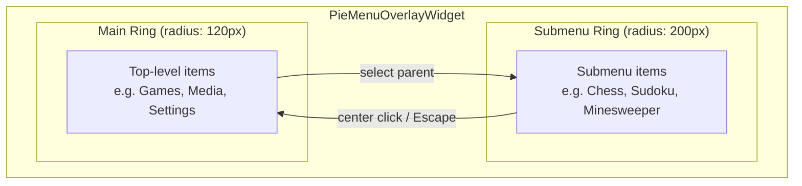
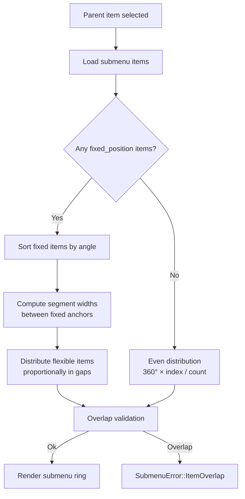
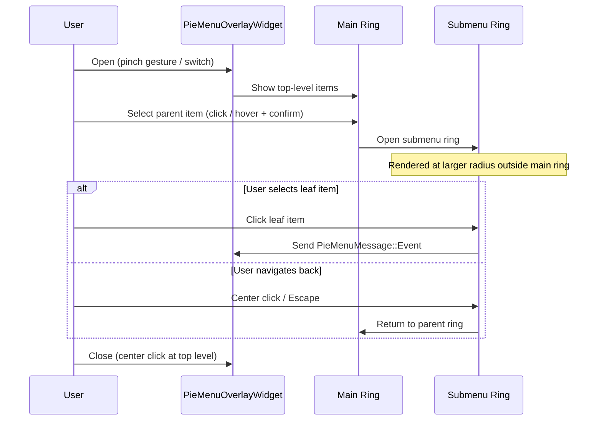
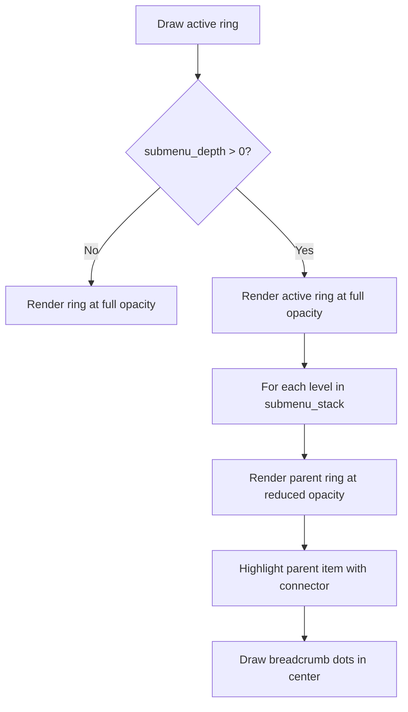
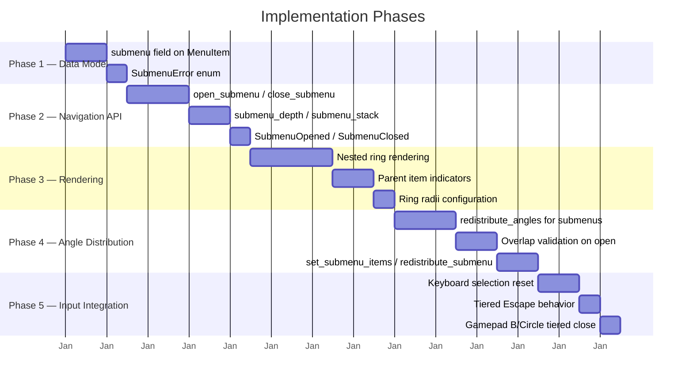

# Submenus — Hierarchical Pie Menu Navigation

---

## 1. Goal and Motivation

This document describes the concept for nested pie menus, enabling hierarchical navigation through multiple rings.

### Goal

Add submenu support to `PieMenuOverlayWidget`, allowing parent items to open a nested ring of child items. Submenu items follow the same angle distribution rules as top-level items (fixed-position and flexible). All input methods (keyboard, mouse, controller) integrate with submenu navigation through tiered escape behavior and keyboard selection reset.

### Motivation

A single ring of menu items can become crowded when the number of options grows. Submenus allow grouping related items under a parent item. For example, the main ring shows "Games", "Media", "Settings" — selecting "Games" opens a second ring with individual game launchers.

---

## 2. Current State

The `smearor-wrot-pie-menu` library currently provides:

- **Touch gesture activation**: Pinch-to-zoom opens/closes the menu (configurable thresholds)
- **Rotation gesture**: Two-finger rotation adjusts the ring angle
- **Menu items**: `MenuItem` with `id`, `label`, `icon_name`, `color`, `angle`, `radius`, `event`, `enabled`, `fixed_position`, `close_on_click` fields
- **Message passing**: `PieMenuMessage` with `Opened`, `Closed`, `Rotate(f32)`, `Event(String)` variants
- **Hover detection**: Mouse hover highlights the nearest item
- **Click-to-select**: Clicking an item sends `PieMenuMessage::Event`
- **Keyboard navigation**: `Ctrl+Space`/`Menu` to open, arrows/`Tab` to cycle, `Enter`/`Space` to confirm (feature: `keyboard`)
- **Mouse scroll rotation**: Proportional `dy` scaling for smooth ring rotation (feature: `mouse-scroll`)
- **Controller support**: SDL2/evdev analog stick rotation and selection (features: `controller-sdl2` / `controller-evdev`)
- **Auto distribution**: `add_menu_item_auto()` with `fixed_position` and proportional segment sizing
- **Overlap validation**: Prevents visually overlapping items with rollback

### What is Missing

| Feature | Status |
|---------|--------|
| Submenu field on `MenuItem` | Not implemented |
| Nested ring rendering | Not implemented |
| `SubmenuOpened` / `SubmenuClosed` messages | Not implemented |
| `open_submenu` / `close_submenu` API | Not implemented |
| Tiered Escape behavior | Not implemented |
| Keyboard selection reset on level change | Not implemented |
| Submenu angle distribution | Not implemented |

---

## 3. Visual Layout and Data Model

### Visual Layout



- The **main ring** is the existing pie menu with top-level items.
- When a parent item is selected, a **submenu ring** opens outside the main ring (larger radius).
- The submenu ring replaces or overlays the main ring visually.
- A "back" action (center click or Escape) returns to the parent ring.

### Data Model

```rust
#[derive(Debug, Clone, Serialize, Deserialize, TypedBuilder)]
pub struct MenuItem {
    // ... existing fields (id, label, icon_name, color, angle, radius,
    //     event, enabled, fixed_position, close_on_click) ...

    /// Optional submenu items. When present, selecting this item
    /// opens a nested ring instead of sending an event.
    ///
    /// Submenu items follow the same `fixed_position` / flexible angle
    /// distribution rules as top-level items (see Auto Distribution below).
    ///
    /// **ID uniqueness**: The `id` field must be globally unique across the
    /// entire menu tree (all levels). This simplifies lookup operations
    /// (`open_submenu`, `get_submenu_items`, `set_submenu_items`) to a flat
    /// search instead of a tree traversal from the root via `submenu_stack`.
    /// Duplicate IDs at any level are undefined behavior.
    #[builder(default, setter(strip_option))]
    pub submenu: Option<Vec<MenuItem>>,
}
```

### Angle Distribution for Submenu Items

Submenu items use the **same `fixed_position` and flexible-position concept** as top-level menu items (described in `IMPROVEMENTS.md` chapter 10 — Automatic Angle Distribution). This means:

- Submenu items with `fixed_position(true)` keep their `angle` as a semantic anchor.
- Submenu items with `fixed_position(false)` (the default) are automatically distributed in the gaps between fixed items using the **largest remainder method** for proportional segment sizing.
- When a submenu is opened, `redistribute_angles` runs on the submenu items to compute their angles.
- Overlap validation runs after redistribution; on failure, the submenu open is aborted with `SubmenuError::ItemOverlap`.



#### Example: Mixed Fixed and Flexible Submenu Items

```rust
// Parent item with submenu containing both fixed and flexible items
overlay.add_menu_item(
    MenuItem::builder()
        .id("media")
        .label("Media")
        .icon_name("applications-multimedia-symbolic")
        .angle(120.0)
        .fixed_position(true)
        .submenu(vec![
            // Fixed items define semantic anchor positions
            MenuItem::builder()
                .id("play-pause")
                .label("Play/Pause")
                .icon_name("media-playback-start-symbolic")
                .angle(0.0)
                .fixed_position(true)
                .event("play-pause")
                .build(),
            MenuItem::builder()
                .id("stop")
                .label("Stop")
                .icon_name("media-playback-stop-symbolic")
                .angle(180.0)
                .fixed_position(true)
                .event("stop")
                .build(),
            // Flexible items are auto-distributed in the gaps
            MenuItem::builder()
                .id("next")
                .label("Next")
                .icon_name("media-skip-forward-symbolic")
                .angle(0.0) // ignored, auto-distributed
                .event("next")
                .build(),
            MenuItem::builder()
                .id("previous")
                .label("Previous")
                .icon_name("media-skip-backward-symbolic")
                .angle(0.0) // ignored, auto-distributed
                .event("previous")
                .build(),
        ])
        .build(),
);
```

With two fixed items at 0° and 180°, the two flexible items are placed at 90° and 270° — the same algorithm used by `add_menu_item_auto()` for the main ring.

---

## 4. Message Flow

```rust
/// Messages sent from the pie menu to the consumer application.
#[derive(Debug, Clone, Serialize, Deserialize)]
pub enum PieMenuMessage {
    // ... existing variants ...
    /// A submenu was opened. Contains the parent item's id.
    SubmenuOpened(String),
    /// The submenu was closed, returning to the parent ring.
    SubmenuClosed(String),
}
```

### Interaction



### Error Type

```rust
/// Error returned when a submenu operation fails.
#[derive(Debug, Clone, thiserror::Error)]
pub enum SubmenuError {
    /// No menu item with the given id was found.
    #[error("Menu item not found: {id}")]
    NotFound { id: String },
    /// The menu item does not have a submenu.
    #[error("Menu item '{id}' has no submenu")]
    NoSubmenu { id: String },
    /// The maximum submenu depth has been reached.
    #[error("Maximum submenu depth reached: {max_depth}")]
    MaxDepthReached { max_depth: u32 },
    /// No submenu is currently open.
    #[error("No submenu is currently open")]
    NoSubmenuOpen,
    /// Submenu items overlap after redistribution.
    #[error("Submenu items overlap after redistribution for parent '{parent_id}'")]
    ItemOverlap { parent_id: String },
}
```

---

## 5. Rendering

### Ring Radii

| Ring Level | Radius (px) | Description |
|------------|-------------|-------------|
| 0 (main)   | 120         | Default ring |
| 1 (submenu)| 200         | First nesting level |
| 2+         | +80 each    | Each level adds 80px |

The radii should be configurable via setters:

```rust
/// Sets the radius for a specific submenu level.
/// Level 0 is the main ring, level 1 is the first submenu, etc.
pub fn set_submenu_radius(&self, level: u32, radius: f32);

/// Sets the global step width between consecutive ring levels.
/// Each submenu level's radius is computed as:
/// `main_radius + level * step`. Default: `80.0`.
/// This avoids configuring each level individually when uniform
/// spacing is sufficient.
pub fn set_submenu_radius_step(&self, step: f32);
```

When `set_submenu_radius` is called for a specific level, it overrides the computed value from the step width for that level. Levels without an explicit override use `main_radius + level * step`.

### Animation

- Submenu opens with a radial expand animation (scale 0.0 → 1.0, fade in).
- Parent ring dims or shrinks slightly to indicate context.
- Closing the submenu reverses the animation.

### Inactive Ring Rendering

While a submenu is active, the parent ring remains visible but rendered in a de-emphasized state to preserve spatial context:

- **Reduced opacity**: Parent ring items are drawn at reduced opacity (e.g. 0.3) — the same visual treatment used for disabled items, but independent of the `enabled` field.
- **No interaction**: Hover and click are not dispatched on inactive rings. Only the active (topmost) ring responds to input.
- **Parent item highlight**: The parent item that opened the current submenu is rendered with a subtle connector line or highlight linking it to the active submenu ring, indicating the navigation path.
- **Stack depth visualization**: Breadcrumb dots in the center circle indicate the current depth (one dot per open level). The deepest dot is highlighted.



### Visual Indicators

- Parent items (those with a submenu) display a small arrow or chevron icon pointing outward.
- The current ring level is indicated visually (e.g., breadcrumb dots in the center).

---

## 6. API

### Adding Submenus

Submenu items can be added with explicit angles (via `add_menu_item`) or with automatic angle distribution. When all submenu items have `fixed_position(false)`, angles are computed automatically when the submenu opens:

```rust
// All submenu items are flexible — angles are auto-distributed
// evenly across 360° when the submenu opens
overlay.add_menu_item(
    MenuItem::builder()
        .id("games")
        .label("Games")
        .icon_name("applications-games-symbolic")
        .angle(0.0)
        .fixed_position(true)
        .submenu(vec![
            MenuItem::builder()
                .id("chess")
                .label("Chess")
                .icon_name("applications-games-symbolic")
                .angle(0.0) // ignored — auto-distributed
                .event("launch-chess")
                .build(),
            MenuItem::builder()
                .id("sudoku")
                .label("Sudoku")
                .icon_name("applications-games-symbolic")
                .angle(0.0) // ignored — auto-distributed
                .event("launch-sudoku")
                .build(),
            MenuItem::builder()
                .id("minesweeper")
                .label("Minesweeper")
                .icon_name("applications-games-symbolic")
                .angle(0.0) // ignored — auto-distributed
                .event("launch-minesweeper")
                .build(),
        ])
        .build(),
);
```

For mixed fixed and flexible submenu items, see the example in [Angle Distribution for Submenu Items](#angle-distribution-for-submenu-items) above.

### Navigation Control

```rust
pub trait PieMenuControlHandler {
    /// Opens the submenu of the item with the given id.
    /// Submenu item angles are redistributed (fixed items keep their
    /// angles, flexible items are auto-distributed) before rendering.
    fn open_submenu(&self, parent_id: &str) -> Result<(), SubmenuError>;

    /// Closes the current submenu and returns to the parent ring.
    fn close_submenu(&self) -> Result<(), SubmenuError>;

    /// Returns the current submenu depth (0 = main ring).
    fn submenu_depth(&self) -> u32;

    /// Redistributes submenu item angles for the submenu of the
    /// item with the given parent id. Fixed items keep their angles;
    /// flexible items are re-spaced proportionally in the gaps.
    fn redistribute_submenu(&self, parent_id: &str);

    /// Updates the submenu items of the item with the given parent id.
    /// Replaces the entire submenu item list. Triggers redistribution
    /// and overlap validation.
    fn set_submenu_items(&self, parent_id: &str, items: Vec<MenuItem>) -> Result<(), SubmenuError>;
}
```

---

## 7. Internal State and Input Integration

```rust
/// Internal state for the pie menu overlay widget implementation.
pub struct PieMenuOverlayWidgetImpl {
    // ... existing fields ...

    /// Stack of opened submenu item ids. Empty means main ring is active.
    pub(crate) submenu_stack: RefCell<Vec<String>>,
}
```

- `submenu_stack` tracks the navigation path.
- `show_pie_menu` always starts at the main ring (stack is cleared).
- `hide_pie_menu` clears the stack.

### Keyboard Selection Reset on Level Change

Whenever the active ring changes (submenu opened or closed), `keyboard_selection` must be reset to avoid stale selection state from the previous level:

```rust
impl PieMenuControlHandler for PieMenuOverlayWidget {
    fn open_submenu(&self, parent_id: &str) -> Result<(), SubmenuError> {
        // Guard: check max depth first before any computation or layout work.
        const MAX_SUBMENU_DEPTH: u32 = 3;
        if self.submenu_depth() >= MAX_SUBMENU_DEPTH {
            return Err(SubmenuError::MaxDepthReached { max_depth: MAX_SUBMENU_DEPTH });
        }

        // ... validation, redistribution ...

        // Guard: empty submenu vectors are treated as leaf items.
        // No push to submenu_stack occurs to avoid rendering empty rings.
        let submenu_items = parent_item.submenu.as_ref()
            .ok_or(SubmenuError::NoSubmenu { id: parent_id.to_string() })?;
        if submenu_items.is_empty() {
            return Err(SubmenuError::NoSubmenu { id: parent_id.to_string() });
        }

        // ... push to submenu_stack ...

        // Reset keyboard selection for the new ring level.
        // Set to the first enabled submenu item (by sorted angle) for immediate
        // navigation, or clear it if the submenu is empty or all items are disabled.
        let submenu_items = self.get_submenu_items(parent_id);
        if let Some(first) = submenu_items
            .iter()
            .filter(|item| item.enabled)
            .min_by(|a, b| a.angle.total_cmp(&b.angle))
        {
            *self.imp().keyboard_selection.borrow_mut() = Some(first.id.clone());
        } else {
            *self.imp().keyboard_selection.borrow_mut() = None;
        }

        self.imp().pie_menu_widget.get().map(|w| w.queue_draw());
        self.send_message(PieMenuMessage::SubmenuOpened(parent_id.to_string()));
        Ok(())
    }

    fn close_submenu(&self) -> Result<(), SubmenuError> {
        let parent_id = self.imp().submenu_stack.borrow().pop().ok_or(SubmenuError::NoSubmenuOpen)?;

        // Reset keyboard selection to the parent item so the user
        // returns to the context they left.
        *self.imp().keyboard_selection.borrow_mut() = Some(parent_id.clone());

        self.imp().pie_menu_widget.get().map(|w| w.queue_draw());
        self.send_message(PieMenuMessage::SubmenuClosed(parent_id));
        Ok(())
    }
}
```

### Escaped Tiered Behavior

The `Escape` key handler must work in a tiered fashion depending on `submenu_depth()`:

```mermaid
flowchart TD
    A[Escape pressed] --> B{submenu_depth > 0?}
    B -- Yes --> C[close_submenu]\nReset keyboard_selection to parent id
    B -- No --> D[hide_pie_menu]\nClear submenu_stack and keyboard_selection
```

In the key controller:

```rust
Key::Escape => {
    if widget.is_pie_menu_open() {
        if widget.submenu_depth() > 0 {
            let _ = widget.close_submenu();
        } else {
            let _ = widget.hide_pie_menu();
        }
        glib::Propagation::Stop
    } else {
        glib::Propagation::Proceed
    }
}
```

This ensures:
- At `depth > 0`: `Escape` closes the current submenu and returns to the parent ring. `keyboard_selection` is set to the parent item id.
- At `depth == 0`: `Escape` closes the entire pie menu. `submenu_stack` and `keyboard_selection` are cleared.

### Gamepad Controller Integration

The same tiered logic applies to gamepad buttons:

| Controller Button | `submenu_depth > 0` | `submenu_depth == 0` |
|---|---|---|
| `B` / `Circle` | `close_submenu()` | `hide_pie_menu()` |
| `A` / `Cross` on parent item | `open_submenu(id)` | `open_submenu(id)` |
| `A` / `Cross` on leaf item | `send_message(Event)` | `send_message(Event)` |

When `open_submenu` is triggered via gamepad, `keyboard_selection` is reset to the first submenu item (same as keyboard). When `close_submenu` is triggered, `keyboard_selection` is set to the parent item id.

### Center Click Behavior

The center close button mirrors the tiered Escape / Gamepad logic. Clicking the center circle does not always close the entire overlay — at `depth > 0` it closes the current submenu first:

```rust
/// Handles a click on the center close button.
/// At `submenu_depth > 0`, closes the current submenu and returns to the
/// parent ring. At `submenu_depth == 0`, closes the entire pie menu.
fn on_center_click(&self) {
    if self.submenu_depth() > 0 {
        let _ = self.close_submenu();
    } else {
        let _ = self.hide_pie_menu();
    }
}
```

This ensures consistent "back" behavior across all input methods:

| Input Method | `submenu_depth > 0` | `submenu_depth == 0` |
|---|---|---|
| `Escape` key | `close_submenu()` | `hide_pie_menu()` |
| `B` / `Circle` button | `close_submenu()` | `hide_pie_menu()` |
| Center click | `close_submenu()` | `hide_pie_menu()` |

---

## 8. Edge Cases

- **Deep nesting**: Limit to a configurable max depth (default: 3) to prevent visual overflow.
- **Empty submenu**: If a parent item has `submenu: Some(vec![])`, `open_submenu` returns `SubmenuError::NoSubmenu`. No push to `submenu_stack` occurs, preventing empty rings from being rendered.
- **Dynamic submenu content**: Updating submenu items at runtime via `set_submenu_items(parent_id, items)` triggers redistribution and overlap validation.
- **Overlap with screen edge**: When the submenu ring extends beyond the widget boundary, clip or scroll.
- **All fixed items at same angle**: The zero-width guard falls back to even distribution (same behavior as `redistribute_angles` in `IMPROVEMENTS.md`).
- **Disabled submenu items**: Items with `enabled: false` render at reduced opacity and do not respond to hover or click, consistent with the main ring behavior.
- **Stale keyboard selection**: `keyboard_selection` is always reset on `open_submenu` (to first enabled sub-item) and `close_submenu` (to parent id) to prevent stale state from a previous ring level.
- **All submenu items disabled**: If all submenu items have `enabled: false`, `keyboard_selection` is set to `None` since no item can be interacted with.
- **Duplicate IDs**: Item `id` values must be globally unique across the entire menu tree. Duplicate IDs at any nesting level result in undefined behavior — lookups may return the wrong item. Consumers are responsible for ensuring uniqueness.

---

## 9. Affected Files

- `src/menu/item.rs` — add `submenu` field to `MenuItem`
- `src/overlay_widget/message/message.rs` — add `SubmenuOpened` / `SubmenuClosed` variants
- `src/overlay_widget/imp/widget.rs` — submenu rendering, navigation logic, click handling
- `src/menu_widget/imp/widget.rs` — render multiple rings, parent item indicators
- `src/overlay_widget/control/handler.rs` — add `open_submenu`, `close_submenu`, `submenu_depth`, `redistribute_submenu`, `set_submenu_items`, `set_submenu_radius`, `set_submenu_radius_step`
- `src/overlay_widget/imp/control/handler.rs` — implement submenu methods, reuse `redistribute_angles` and `validate_all_no_overlap`, reset `keyboard_selection` on `open_submenu` / `close_submenu`
- `src/overlay_widget/imp/input.rs` — tiered `Escape` handling based on `submenu_depth()`
- `src/menu_widget/menu_item/error.rs` — add `SubmenuError` (one enum per file)
- `src/menu_widget/imp/menu_item/handler.rs` — reuse `redistribute_angles` for submenu item distribution

---

## 10. Phase Plan

The submenu feature is grouped into phases by dependency and complexity. Each phase can be implemented and shipped independently.



### Phase 1 — Data Model

Low-risk, additive changes. No impact on existing behavior.

- `submenu: Option<Vec<MenuItem>>` field on `MenuItem`
- `SubmenuError` enum with `NotFound`, `NoSubmenu`, `MaxDepthReached`, `NoSubmenuOpen`, `ItemOverlap` variants

### Phase 2 — Navigation API

Core submenu navigation. Depends on Phase 1.

- `open_submenu(parent_id)` with validation, redistribution, and keyboard selection reset
- `close_submenu()` with keyboard selection reset to parent id
- `submenu_depth()` returning `submenu_stack.len() as u32`
- `SubmenuOpened` / `SubmenuClosed` message variants

### Phase 3 — Rendering

Visual nested rings. Depends on Phase 2.

- Render submenu ring at larger radius outside main ring
- Parent item chevron/arrow indicators
- Configurable ring radii via `set_submenu_radius(level, radius)` and `set_submenu_radius_step(step)`
- Radial expand animation on open, reverse on close

### Phase 4 — Angle Distribution

Reuses existing `redistribute_angles` and `validate_all_no_overlap`. Depends on Phase 2.

- Run `redistribute_angles` on submenu items when `open_submenu` is called
- Fixed items keep their angle; flexible items are auto-distributed proportionally
- Overlap validation after redistribution; abort with `SubmenuError::ItemOverlap` on failure
- `set_submenu_items(parent_id, items)` for dynamic content updates with redistribution
- `redistribute_submenu(parent_id)` for manual re-spacing

### Phase 5 — Input Integration

Integrates submenu navigation with existing input methods. Depends on Phase 2.

- `keyboard_selection` reset on `open_submenu` (to first sub-item by sorted angle) and `close_submenu` (to parent id)
- Tiered `Escape` key: `close_submenu` at `depth > 0`, `hide_pie_menu` at `depth == 0`
- Gamepad `B`/`Circle`: `close_submenu` at `depth > 0`, `hide_pie_menu` at `depth == 0`
- Gamepad `A`/`Cross` on parent item: `open_submenu(id)`

---

## 11. Unit Tests

All tests are inline (`#[cfg(test)]` module in the respective source files) per AGENTS.md testing requirements.

### Data Model Tests (`src/menu/item.rs`)

- `test_submenu_field_default_none` — `submenu` field defaults to `None`
- `test_submenu_with_items` — `submenu` field accepts `Vec<MenuItem>`
- `test_submenu_nested` — submenu items can themselves have submenus
- `test_submenu_id_globally_unique` — submenu item with same id as top-level item is flagged (future validation)

### Navigation Tests (`src/overlay_widget/imp/control/handler.rs`)

- `test_open_submenu_not_found` — returns `SubmenuError::NotFound` for unknown id
- `test_open_submenu_no_submenu` — returns `SubmenuError::NoSubmenu` for leaf item
- `test_open_submenu_max_depth` — returns `SubmenuError::MaxDepthReached` at depth limit
- `test_open_submenu_success` — pushes to `submenu_stack`, sends `SubmenuOpened`
- `test_open_submenu_resets_keyboard_selection` — `keyboard_selection` set to first sub-item
- `test_open_submenu_empty_returns_no_submenu` — `open_submenu` returns `SubmenuError::NoSubmenu` for `submenu: Some(vec![])`, no push to `submenu_stack`
- `test_open_submenu_all_disabled_clears_keyboard_selection` — `keyboard_selection` set to `None` when all submenu items are disabled
- `test_open_submenu_skips_disabled_for_initial_selection` — `keyboard_selection` set to first enabled item, skipping disabled items with smaller angles
- `test_close_submenu_no_submenu_open` — returns `SubmenuError::NoSubmenuOpen` when stack is empty
- `test_close_submenu_success` — pops from `submenu_stack`, sends `SubmenuClosed`
- `test_close_submenu_resets_keyboard_selection` — `keyboard_selection` set to parent id
- `test_submenu_depth` — returns correct depth after opening/closing submenus
- `test_show_pie_menu_clears_submenu_stack` — `show_pie_menu` resets `submenu_stack` to empty
- `test_hide_pie_menu_clears_submenu_stack` — `hide_pie_menu` resets `submenu_stack` to empty

### Angle Distribution Tests (`src/menu_widget/imp/menu_item/handler.rs`)

- `test_submenu_redistribute_no_fixed_items` — all submenu items evenly distributed
- `test_submenu_redistribute_two_fixed_items` — flexible items placed proportionally in gaps
- `test_submenu_redistribute_all_fixed_same_angle` — zero-width guard falls back to even distribution
- `test_submenu_open_overlap_aborts` — `SubmenuError::ItemOverlap` returned when overlap detected
- `test_submenu_set_items_triggers_redistribution` — `set_submenu_items` redistributes and validates

### Input Integration Tests (`src/overlay_widget/imp/input.rs`)

- `test_escape_tiered_close_submenu` — `Escape` at `depth > 0` calls `close_submenu`
- `test_escape_tiered_hide_pie_menu` — `Escape` at `depth == 0` calls `hide_pie_menu`
- `test_gamepad_b_tiered_close_submenu` — `B`/`Circle` at `depth > 0` calls `close_submenu`
- `test_gamepad_b_tiered_hide_pie_menu` — `B`/`Circle` at `depth == 0` calls `hide_pie_menu`
- `test_center_click_tiered_close_submenu` — center click at `depth > 0` calls `close_submenu`
- `test_center_click_tiered_hide_pie_menu` — center click at `depth == 0` calls `hide_pie_menu`

---

## 12. README.md Feature List Update

After implementing all phases, update the **Features** section in `README.md`:

```markdown
## Features

- **Touch gesture activation**: Opens on pinch-to-zoom, closes on pinch-out (configurable thresholds)
- **Rotation gesture**: Rotate the menu ring with a two-finger rotation gesture
- **Keyboard navigation**: Open with `Ctrl+Space`/`Menu`, navigate with arrows, confirm with `Enter`/`Space` (feature: `keyboard`)
- **Mouse scroll rotation**: Rotate the ring with the mouse wheel, proportional to scroll distance (feature: `mouse-scroll`)
- **Controller support**: Navigate with game controller sticks and buttons (features: `controller-sdl2` or `controller-evdev`)
- **Submenus**: Nested pie menu rings with hierarchical navigation and automatic angle distribution
- **Configurable menu items**: Add/remove items programmatically with custom icons, colors, angles, and events
- **Disabled state**: Disable individual menu items (reduced opacity, no click, no hover, skipped by keyboard navigation)
- **Builder pattern**: Fluent API for ergonomic widget construction (`with_message_sender()`, `with_menu_item()`, etc.)
- **Automatic angle distribution**: Auto-distribute items evenly across the ring with `add_menu_item_auto()`
- **Fixed-position items**: Pin semantically positioned items (e.g. "Rotate CW" at 0°) that resist redistribution
- **Overlap validation**: Prevents visually overlapping items with automatic rollback on failure
- **Hover detection**: Mouse hover highlights the nearest menu item
- **Click-to-select**: Click a menu item to trigger its event
- **Center close button**: Click the center circle to close the menu
- **GTK4 native**: Built as a proper GTK4 widget with `BinLayout` overlay
```

Also update the **PieMenuMessage** section:

```markdown
### `PieMenuMessage`

Messages sent from the pie menu to the consumer:
- `Opened` — the pie menu was opened
- `Closed` — the pie menu was closed
- `Rotate(f32)` — rotation delta in degrees from the rotation gesture
- `Event(String)` — the event name of the clicked menu item
- `SubmenuOpened(String)` — a submenu was opened (contains parent item id)
- `SubmenuClosed(String)` — a submenu was closed, returning to the parent ring (contains parent item id)
```

---

## 13. Book Update

The mdBook in `book/src/` needs the following updates:

### SUMMARY.md — New Chapter

```markdown
# Summary

- [Introduction](introduction.md)
- [Quick Start](quickstart.md)
- [The PieMenuOverlayWidget](widget.md)
    - [MenuItem](menu_item.md)
    - [PieMenuMessage](message.md)
    - [API Reference](api.md)
    - [Thresholds](thresholds.md)
    - [Disabled State](disabled_state.md)
    - [Builder Pattern](builder_pattern.md)
    - [Auto Distribution](auto_distribution.md)
    - [Overlap Validation](overlap_validation.md)
    - [Input Handling](input_handling.md)
    - [Submenus](submenus.md)
- [Architecture](architecture.md)
- [Examples](examples.md)
```

### New Pages

- **`book/src/submenus.md`** — Submenu data model, nested ring rendering, angle distribution for submenu items, tiered Escape behavior, keyboard selection reset, gamepad integration, `SubmenuError` types

### Updated Pages

- **`book/src/menu_item.md`** — Document `submenu` field
- **`book/src/message.md`** — Document `SubmenuOpened` and `SubmenuClosed` variants
- **`book/src/widget.md`** — Document `submenu_stack` state, nested ring rendering
- **`book/src/api.md`** — Add `open_submenu`, `close_submenu`, `submenu_depth`, `redistribute_submenu`, `set_submenu_items`

---

## 14. Limitations

### Non-Goals

- **Custom widget content**: Embedding arbitrary GTK4 widgets as item content is described in `CUSTOM_WIDGET.md`
- **Animation transitions**: Smooth angle transitions during submenu redistribution are not part of this concept
- **Submenu search/filtering**: Searching within submenu items is not part of this concept

### Technical Limitations

- **Maximum depth**: Submenu nesting is limited to a configurable max depth (default: 3) to prevent visual overflow. Deeper nesting is aborted with `SubmenuError::MaxDepthReached`.
- **Submenu angle distribution is O(n log n)**: `redistribute_angles` sorts items by angle on every `open_submenu` call. For typical submenus (≤ 8 items) this is negligible.
- **Overlap validation is O(n²)**: `validate_all_no_overlap` iterates all submenu items against each other. For typical submenus this is negligible.
- **`submenu_stack` is not thread-safe**: `RefCell<Vec<String>>` is `!Sync`. All access occurs on the GTK main thread. Concurrent access from background threads is undefined behavior.
- **Ring radius overflow**: When the submenu ring extends beyond the widget boundary, items may be clipped. Consumers should ensure sufficient widget size or adjust radii via `set_submenu_radius`.
- **Recursive submenu data**: `MenuItem.submenu: Option<Vec<MenuItem>>` is recursive. Deeply nested structures are bounded by `MaxDepthReached` at runtime, but the type system does not enforce a depth limit at compile time.
- **Global ID uniqueness is not enforced**: The `id` field must be globally unique across the entire menu tree, but this is not validated at construction time. Duplicate IDs result in undefined behavior. A future improvement could add a validation pass in `add_menu_item` that recursively checks for duplicate IDs across all submenu levels.

### Backward Compatibility

The `submenu` field defaults to `None`, preserving current behavior for existing consumers. No existing API signatures change. The `SubmenuOpened` and `SubmenuClosed` message variants are additive — consumers that pattern-match on `PieMenuMessage` without a wildcard arm will need to add handling, but the `#[non_exhaustive]` attribute on the enum (if present) already requires this.

---

## 15. Summary

This concept paper outlines submenu support for `smearor-wrot-pie-menu`, organized into 5 implementation phases:

| Phase | Feature | Complexity |
|-------|---------|------------|
| 1 — Data Model | `submenu` field, `SubmenuError` enum | Low |
| 2 — Navigation API | `open_submenu`, `close_submenu`, `submenu_depth`, messages | Medium |
| 3 — Rendering | Nested rings, parent indicators, radii configuration | Medium |
| 4 — Angle Distribution | `redistribute_angles` reuse, overlap validation, `set_submenu_items` | Medium |
| 5 — Input Integration | Keyboard selection reset, tiered Escape, gamepad integration | Low |

### Key Design Decisions

- **`submenu: Option<Vec<MenuItem>>`** — recursive type for arbitrary nesting depth
- **`submenu_stack: RefCell<Vec<String>>`** — tracks navigation path, cleared on show/hide
- **`total_cmp`** for angle sorting in keyboard selection reset, per AGENTS.md panic-free guidelines
- **`thiserror` error type** (`SubmenuError`) for all fallible submenu operations
- **Reuse of `redistribute_angles` and `validate_all_no_overlap`** — same algorithm as top-level items
- **Tiered Escape** — `close_submenu` at `depth > 0`, `hide_pie_menu` at `depth == 0`
- **Keyboard selection reset** — to first sub-item on `open_submenu`, to parent id on `close_submenu`
- **Feature-gated input integration** — tiered Escape and gamepad B/Circle only active when `keyboard` or `controller-*` features are enabled

### Expected Outcome

After implementation, consumers can:

1. Define nested menu items with `submenu: Some(vec![...])`
2. Open/close submenus programmatically via `open_submenu` / `close_submenu`
3. Navigate submenus with keyboard (tiered Escape, selection reset)
4. Navigate submenus with gamepad (tiered B/Circle, selection reset)
5. Auto-distribute submenu item angles with `fixed_position` support
6. Dynamically update submenu content via `set_submenu_items`
7. Receive `SubmenuOpened` / `SubmenuClosed` messages for state tracking

All changes are backward compatible and covered by 24 inline unit tests.
